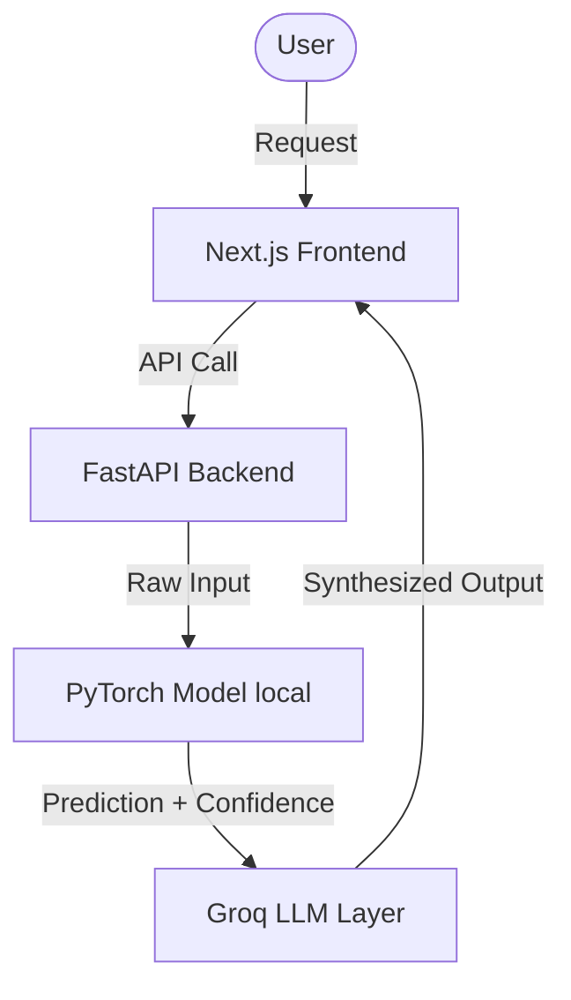

# VAIC 2026 — CLAUDE.md (Agent Guide)

> **Đọc file này trước khi viết bất kỳ dòng code nào.**  
> Áp dụng cho: Claude Code, Cursor, Copilot, Gemini CLI, và mọi AI coding agent.

---

## 1. Bối Cảnh Dự Án

**Loại:** Hackathon 48 giờ (17–19/07/2026) — không phải production software.  
**Nguyên tắc tối cao:** `working > perfect > elegant`. Không over-engineer.  
**Mục tiêu kép:**
- 🥇 **Top 1** ($10,000) — cần ghi điểm toàn diện cả 6 tiêu chí
- 🔥 **Best PyTorch Award** ($5,000 từ Meta) — PyTorch phải là **core** của giải pháp, không phải decoration

**Track:** Nông nghiệp — BioListen VN (Biodiversity monitoring through Ecological acoustics)
**Deep Analysis & Technical Plan:** [docs/BIOLISTEN_PLAN.md](file:///c:/Users/Le%20Nguyen%20Gia%20Hung/everything/Code/Organization/NeuraX.ai/vaic-2026/docs/BIOLISTEN_PLAN.md)
**Active Task Board:** [docs/TASKS.md](file:///c:/Users/Le%20Nguyen%20Gia%20Hung/everything/Code/Organization/NeuraX.ai/vaic-2026/docs/TASKS.md)

---

## 2. Team — Ai Làm Gì

| Tên | Branch | Owns | Không cần đụng |
|-----|--------|------|----------------|
| **Huỳnh Quốc Việt** (AI Lead) | `feature/ai` | `backend/services/`, PyTorch models, inference logic | Frontend UI |
| **Lê Nguyễn Gia Hưng** (AI All-round) | `feature/ui` | `frontend/src/`, LLM prompts, Groq integration | Railway deploy |
| **Hồ Minh Hiếu** (SE) | `feature/api` | `backend/api/routes/`, FastAPI endpoints, Railway deploy, Vercel config | Model training |

**Khi agent được hỏi về code:**
- Nếu task liên quan đến PyTorch/model → hướng về `backend/services/` (Việt's domain)
- Nếu task liên quan đến UI/UX/LLM → hướng về `frontend/src/` (Hưng's domain)
- Nếu task liên quan đến API route/deploy → hướng về `backend/api/` (Hiếu's domain)

---

## 3. Scoring Rubric — Viết Code Theo Đây

Agent cần biết ban giám khảo chấm điểm thế nào để ưu tiên đúng:

| Tiêu chí | Điểm | Ý nghĩa khi viết code |
|----------|------|----------------------|
| **Technical Implementation** | 20đ | Code chạy được, có live URL, không crash khi demo |
| **AI Native Architecture** | 20đ | PyTorch là core — không phải gọi API rồi trả về text |
| **Business Viability** | 20đ | Comment code bằng business context, không chỉ technical |
| **Presentation & Demo** | 20đ | UI phải có thể demo được, loading states, error handling |
| **UX & Design** | 10đ | UI không xấu, user hiểu được ngay |
| **AI Safety & Trust** | 10đ | Confidence scores, fallback khi model uncertain |

**Hệ quả thực tế:**
- Mọi endpoint phải trả về `confidence` score (liên quan đến AI Safety 10đ)
- Mọi UI component phải có loading state (liên quan đến Demo 20đ)
- Comments trong code nên giải thích business value, không chỉ technical (Business 20đ)

---

## 4. File Map — Ownership & Purpose

```
vaic-2026/
├── README.md                    ← Overview, update link sau khi deploy
├── CLAUDE.md                    ← File này
├── CONTRIBUTING.md              ← Git workflow, deadlines, deliverables
│
├── backend/                     ← Hiếu + Việt
│   ├── main.py                  ← App entry — Hiếu registers routes đây
│   ├── config.py                ← Settings, env vars — không sửa thường xuyên
│   ├── requirements.txt         ← KHÔNG thêm deps nặng không cần thiết
│   ├── Dockerfile               ← Railway build — chỉ Hiếu sửa
│   ├── api/
│   │   ├── deps.py              ← Shared Depends() — auth skeleton (để TODO)
│   │   └── routes/
│   │       └── ai.py            ← PLACEHOLDER — Hiếu thay bằng route thật
│   └── services/
│       ├── pytorch_components.py ← VIỆT'S CORE — 3 PyTorch components
│       └── ai_services.py       ← Groq LLM + ImageClassifier wrappers
│
├── frontend/                    ← Hưng
│   └── src/
│       ├── app/
│       │   ├── layout.tsx       ← Root layout — ít sửa
│       │   ├── page.tsx         ← VIẾT LẠI sau khi biết track
│       │   └── globals.css      ← Tailwind v4 base
│       └── lib/
│           └── api.ts           ← API client — Hưng thêm methods mới ở đây
│
└── docs/
    └── ai_collab_log.md         ← BẮT BUỘC — mọi người update liên tục
```

---

## 5. Workflow Trong 48 Giờ

### T+0 (11:00 ngày 17/07) — Nhận đề bài, quyết định trong 30 phút

```
1. Đọc tất cả 8 track descriptions
2. Áp câu hỏi này cho mỗi track có thể:
   - PyTorch có thể là CORE (không phải decoration) không? → YES = keep, NO = drop
   - Có thể demo được bằng live URL sau 36h không? → YES = keep, NO = drop  
   - Business case pitch được trong 2 câu không? → YES = chốt

3. Assign task ngay (không chờ):
   Việt → bắt đầu research model architecture + dataset
   Hưng → setup LLM system prompt + data flow
   Hiếu → tạo FastAPI route skeleton + đảm bảo deploy pipeline ready
```

### T+0 đến T+6 (11:00 → 17:00 ngày 17/07) — Foundation

| Người | Milestone T+6 |
|-------|--------------|
| Việt | PyTorch model chạy inference được (dù accuracy chưa tốt) |
| Hưng | Gọi được LLM, nhận được response về UI |
| Hiếu | `/api/[track]/predict` endpoint nhận request, trả response (mock ok) |

### T+6 đến T+24 — Integration

- Việt → kết nối model vào Hiếu's endpoint
- Hưng → UI gọi được API, hiển thị result
- **11:00 ngày 18/07: CHECKPOINT 1** → Hiếu submit project name + description

### T+24 đến T+36 — Polish

- Việt → cải thiện accuracy, thêm confidence scores
- Hưng → UI/UX polish, demo flow chuẩn bị
- Hiếu → deploy stable, test live URL
- **23:00 ngày 18/07: CHECKPOINT 2** → Hiếu submit live URL + GitHub link

### T+36 đến T+48 — Final

- Fix bugs, chuẩn bị demo script
- Hưng → presentation slides + demo video
- **11:00 ngày 19/07: FINAL** → nộp đủ 5 deliverables

---

## 6. Coding Conventions

### Python (Việt & Hiếu)

```python
# ✅ Lazy import PyTorch (không load ở module level)
@router.post("/predict", response_model=PredictResponse)
async def predict(req: PredictRequest):
    from services.pytorch_components import get_phobert  # import trong function
    model = get_phobert()
    result = model.classify_zero_shot(req.text, req.labels)
    return PredictResponse(
        result=result["top_label"],
        confidence=result["top_score"],  # ← LUÔN trả về confidence
        details=result["all_labels"],
    )

# ✅ Pydantic models cho mọi request/response
class PredictResponse(BaseModel):
    result: str
    confidence: float  # ← bắt buộc cho AI Safety score
    details: list | None = None

# ❌ Không làm
import torch  # top-level import trong routes
model = WhisperInference()  # module-level instantiation
return {"result": "something"}  # raw dict, không có confidence
```

### TypeScript (Hưng)

```typescript
// ✅ Dùng api client, không fetch trực tiếp
"use client";
import api from "@/lib/api";

const [loading, setLoading] = useState(false);  // ← loading state bắt buộc
const [result, setResult] = useState<ResultType | null>(null);

const handleSubmit = async () => {
  setLoading(true);
  try {
    const data = await api.predict(input);
    setResult(data);
  } catch (e) {
    // error handling — không để crash silently
  } finally {
    setLoading(false);
  }
};

// ❌ Không làm
const res = await fetch("http://localhost:8000/...");  // fetch trực tiếp
// Không có loading state → xấu khi demo
```

---

## 7. PyTorch Components — Dùng Ngay, Không Phải Viết Lại

File: `backend/services/pytorch_components.py`

**Models download tự động khi gọi lần đầu — KHÔNG cần pre-download.**

```python
from services.pytorch_components import get_whisper, get_phobert, get_efficientnet

# Tuỳ track, chọn component phù hợp:

# Audio input (Education, Healthcare voice) → Whisper
result = get_whisper().transcribe("audio.wav", language="vi")
# → {"text": "...", "segments": [...], "duration_s": 1.2}

# Text tiếng Việt (Banking, Education, SME) → PhoBERT
result = get_phobert().classify_zero_shot(
    text="Tôi cần hỗ trợ vay vốn mua nhà",
    labels=["tư vấn tài chính", "khiếu nại", "hỗ trợ kỹ thuật"]
)
# → {"top_label": "tư vấn tài chính", "top_score": 0.87, "all_labels": [...]}

# Image input (Healthcare, Agriculture) → EfficientNet
result = get_efficientnet().predict_from_file("image.jpg")
# → {"top5_probs": [...], "top5_indices": [...], "confidence": 0.94}
```

**Chọn component theo track:**

| Track | PyTorch component | Lý do |
|-------|-----------------|-------|
| Y tế & Sức khỏe | EfficientNet | Phân tích ảnh y tế, X-ray |
| Ngân hàng & Tài chính | PhoBERT | Phân loại intent, phát hiện gian lận từ text |
| Giáo dục | Whisper + PhoBERT | Pronunciation scoring + text classification |
| Nông nghiệp | EfficientNet | Nhận diện bệnh cây, phân loại nông sản |
| SME Năng suất | PhoBERT | NLP agents, tự động phân loại tác vụ |
| Thiên tai | EfficientNet | Phân tích ảnh vệ tinh, satellite imagery |

---

## 8. Thêm Feature Mới — Step-by-Step

Khi biết track, agent thực hiện theo thứ tự này:

### Bước 1: Backend route (Hiếu)
```python
# Tạo: backend/api/routes/[track].py
from fastapi import APIRouter, UploadFile, File
from pydantic import BaseModel

router = APIRouter(prefix="/api/[track]", tags=["[Track]"])

class InputModel(BaseModel):
    text: str  # hoặc field phù hợp

class OutputModel(BaseModel):
    result: str
    confidence: float  # LUÔN có
    explanation: str   # business-friendly explanation

@router.post("/predict", response_model=OutputModel)
async def predict(req: InputModel):
    from services.pytorch_components import get_phobert
    model = get_phobert()
    raw = model.classify_zero_shot(req.text, ["label1", "label2"])
    return OutputModel(
        result=raw["top_label"],
        confidence=raw["top_score"],
        explanation=f"Phân tích cho thấy đây là '{raw['top_label']}' với độ tin cậy {raw['top_score']:.0%}",
    )
```

### Bước 2: Đăng ký route (Hiếu)
```python
# backend/main.py — thêm vào phần routes
from api.routes.[track] import router as [track]_router
app.include_router([track]_router)
```

### Bước 3: API method frontend (Hưng)
```typescript
// frontend/src/lib/api.ts — thêm vào class ApiClient
async predict[Track](input: InputType): Promise<OutputType> {
  return this.request<OutputType>("/api/[track]/predict", {
    method: "POST",
    body: JSON.stringify(input),
  });
}
```

### Bước 4: UI page (Hưng)
```typescript
// frontend/src/app/page.tsx (hoặc route mới)
"use client";
// Input form → call api.[track]() → hiển thị result với confidence bar
```

### Bước 5: Update AI collab log (người làm task đó)
```markdown
| [HH:MM 17/07] | Claude Code | Tạo /api/healthcare/predict endpoint | ✅ | Dùng EfficientNet |
```

---

## 9. Quy Tắc Không Làm (Tiết Kiệm Thời Gian)

```
❌ Authentication phức tạp    → JWT skeleton để TODO là đủ
❌ Database migrations         → Supabase auto, không cần ORM
❌ Unit tests                 → Test thủ công, không viết pytest
❌ Error logging phức tạp     → print() là đủ cho 48h
❌ Pre-download models        → Lazy load, download khi cần
❌ Fine-tune từ đầu           → Pretrained + zero-shot hoặc fine-tune nhẹ
❌ Microservices              → 1 FastAPI app là đủ
❌ CSS animations phức tạp    → Tailwind utility classes là đủ
```

---

## 10. Deliverables — Agent Cần Biết

| # | Deliverable | Owner | Deadline |
|---|-------------|-------|----------|
| 1 | Presentation slides | Hưng | T+44h |
| 2 | Demo video ≤ 5 phút | Hưng record | T+46h |
| 3 | GitHub repo (public) | Hiếu verify | T+47h |
| 4 | **Live deployed URL** | Hiếu | T+36h (Checkpoint 2) |
| 5 | AI Collaboration Log | Cả team | Realtime |

**Agent note:** Khi tạo bất kỳ feature nào, nhắc người dùng update `docs/ai_collab_log.md`.

---

## 11. Các Công Cụ Hỗ Trợ Đội Thi (Tăng Tốc 10x)

### API Testing (REST Client)
- File `backend/api_tests.http` được cấu hình sẵn để test local và production API.
- Cài extension **REST Client** trên VS Code / Cursor để gửi request trực tiếp từ file này bằng cách bấm nút `Send Request` xuất hiện trên dòng code.

### Database & Storage (Supabase)
- Dự án sử dụng `supabase-py` ở backend và REST/Client library ở frontend.
- Cấu hình biến môi trường `SUPABASE_URL` và `SUPABASE_KEY` trong file `.env`.
- Hạn chế viết ORM phức tạp, tận dụng tính năng tự động tạo bảng và API REST của Supabase để lấy/thêm dữ liệu.

### Ghi hình & Dựng Demo (Nộp bài)
- **Quay phim màn hình:** Dùng **OBS Studio** (Free) hoặc **Loom** để lưu nhanh và demo luồng chạy của sản phẩm.
- **Biên tập clip ≤ 5 phút:** Dùng **CapCut** trên máy của Hưng để ghép tiếng, cắt phân đoạn lỗi và xuất video nhanh.

### Vẽ sơ đồ kiến trúc (AI Architecture)
- Vẽ sơ đồ hệ thống bằng **Excalidraw** hoặc mô tả trực tiếp bằng cú pháp **Mermaid.js** trong file markdown:


---

## 12. Emergency Fallbacks

| Tình huống | Giải pháp |
|------------|-----------|
| PyTorch model quá chậm | Dùng Groq API + PhoBERT nhẹ hơn |
| Railway deploy fail | `ngrok http 8000` → temporary live URL |
| WiFi venue chậm | Mobile hotspot |
| Cần GPU | Google Colab free tier |
| Model accuracy thấp | Zero-shot với PhoBERT + LLM explanation |
