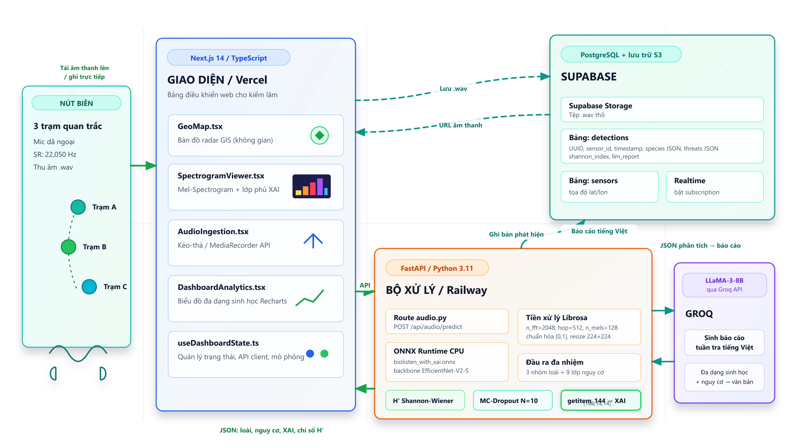

# 🌿 BioListen VN

<div align="center">

### Hệ thống giám sát âm thanh rừng bằng AI phục vụ bảo tồn đa dạng sinh học và phát hiện mối đe dọa tại Vườn Quốc gia Cúc Phương

**Đội thi NeuraX.ai** • Vietnam AI Innovation Challenge (VAIC) 2026

[](https://biolistenvn.vercel.app/)
[](YOUR_RAILWAY_URL)
[]
[]
[]
[]
[]
[]
[]
[]

</div>

---

<p align="center">
  
</p>

---

## 🚀 Trải nghiệm trực tiếp

| Dịch vụ | Liên kết |
|---------|----------|
| 🌐 Frontend | https://biolistenvn.vercel.app/ |
| ⚡ Backend API | YOUR_RAILWAY_URL |
| ❤️ Health Check | YOUR_RAILWAY_URL/health |

---

## 📖 Giới thiệu

**BioListen VN** là hệ thống giám sát âm thanh rừng ứng dụng AI nhằm hỗ trợ kiểm lâm theo dõi đa dạng sinh học và phát hiện sớm các mối đe dọa trong Vườn Quốc gia Cúc Phương.

Hệ thống phân tích các đoạn ghi âm ngắn từ các trạm cảm biến âm thanh trong rừng và tự động:

- 🐦 Phát hiện các nhóm sinh vật chỉ thị (Chim, Ếch, Côn trùng)
- 🚨 Phát hiện các mối đe dọa như cưa máy, tiếng súng, cháy rừng, xe cơ giới,...
- 📊 Tính toán chỉ số đa dạng sinh học Shannon-Wiener
- 🔥 Hiển thị Mel Spectrogram kết hợp XAI Heatmap giúp giải thích quyết định của mô hình
- 🤖 Sinh báo cáo tuần tra bằng tiếng Việt với Groq LLaMA
- 📜 Lưu lịch sử phát hiện để theo dõi diễn biến theo thời gian

---

## 🎯 Bài toán

Việc tuần tra rừng hiện nay vẫn phụ thuộc nhiều vào nhân lực và camera bẫy ảnh, trong khi nhiều dấu hiệu quan trọng lại xuất hiện dưới dạng âm thanh như:

- Tiếng chim, ếch, côn trùng phản ánh sức khỏe hệ sinh thái.
- Tiếng cưa máy.
- Tiếng súng.
- Cháy rừng.
- Xe cơ giới xâm nhập.
- Các hoạt động bất thường khác.

BioListen VN giúp chuyển đổi dữ liệu âm thanh thành thông tin trực quan, giúp kiểm lâm đưa ra quyết định nhanh hơn.

---

## 👥 Thành viên

| Thành viên | Vai trò |
|------------|---------|
| **Huỳnh Quốc Việt** | AI Lead • Model Engineering |
| **Lê Nguyễn Gia Hưng** | AI Engineer • Full-stack Integration |
| **Hồ Minh Hiếu** | Software Engineer • Backend & Deployment |

**FPT University**

**Team NeuraX.ai**

---

# 🏗️ Kiến trúc hệ thống


| Thành phần | Công nghệ |
|------------|-----------|
| Frontend | Next.js 16 • React 19 • TypeScript • TailwindCSS • Recharts |
| Backend | FastAPI • Python |
| AI Engine | ONNX Runtime |
| Database | Supabase PostgreSQL |
| Storage | Supabase Storage |
| Explainable AI | Grad-CAM Style |
| LLM Report | Groq LLaMA |

---

Luồng xử lý

```text
Thiết bị ghi âm
        │
        ▼
Frontend Dashboard
        │
        ▼
FastAPI Backend
        │
        ▼
Tiền xử lý Audio
        │
        ▼
ONNX Runtime
        │
        ├────────► Species Detection
        │
        ├────────► Threat Detection
        │
        ├────────► XAI Heatmap
        │
        ├────────► Biodiversity Index
        │
        ▼
Groq LLM Report
        │
        ▼
Dashboard
```

---

# 🧠 Pipeline AI


### 1. Tiền xử lý

- WAV 5 giây
- 22,050 Hz
- Mel Spectrogram
- Resize 224×224
- Normalize
- Tensor float32

---

### 2. Suy luận mô hình

ONNX Runtime dự đoán đồng thời:

- 3 nhóm sinh vật
- 9 loại mối đe dọa

---

### 3. Explainable AI (XAI)

Sinh Heatmap bằng:

- Feature Map
- Mean Activation
- Gaussian Blur
- Color Mapping

để trực quan hóa vùng âm thanh mà mô hình tập trung.

---

### 4. Biodiversity

Tính:

**Shannon-Wiener Index**

\[
H'=-\sum p_i \ln(p_i)
\]

---

### 5. Sinh báo cáo

Groq LLaMA tạo:

- Tóm tắt hiện trạng
- Mức độ nguy hiểm
- Khuyến nghị tuần tra

---

# 📂 Cấu trúc dự án

```text
backend/
│
├── api/
├── models/
├── services/
├── uploads/
├── main.py
│
frontend/
│
├── src/
├── public/
│
docs/
│
├── architecture_diagram_high_fidelity.svg
├── model_architecture.svg
├── WALKTHROUGH_VIET.md
├── presentation/
└── ai_collab_log.md
```

---

# ⚡ Chạy dự án

## Backend

```bash
cd backend

python -m venv venv

venv\Scripts\activate

pip install -r requirements-light.txt

copy .env.example .env

uvicorn main:app --reload
```

Mặc định:

```
http://localhost:8000
```

---

## Frontend

```bash
cd frontend

npm install

copy .env.example .env.local

npm run dev
```

Mặc định

```
http://localhost:3000
```

---

## API

| Endpoint | Chức năng |
|----------|-----------|
| GET /health | Health Check |
| POST /api/audio/predict | Phân tích âm thanh |
| GET /api/audio/history | Lịch sử |
| GET /api/audio/health-trend | Chỉ số đa dạng sinh học |

---

# 🔧 Biến môi trường

### Backend

| Biến | Mô tả |
|------|-------|
| GROQ_API_KEY | Groq API |
| SUPABASE_URL | Supabase |
| SUPABASE_KEY | Supabase Key |
| SECRET_KEY | Secret |
| DEBUG | Debug Mode |

---

### Frontend

| Biến | Mô tả |
|------|-------|
| NEXT_PUBLIC_API_URL | Backend URL |
| NEXT_PUBLIC_SUPABASE_URL | Supabase URL |
| NEXT_PUBLIC_SUPABASE_ANON_KEY | Supabase Key |

---

# 📦 Tài nguyên nộp bài

- Kiến trúc hệ thống
- Kiến trúc mô hình AI
- Walkthrough tiếng Việt
- Pitch Deck
- Demo Video
- AI Collaboration Log

Toàn bộ nằm trong thư mục `docs/`.

---

# ☁️ Triển khai

| Thành phần | Nền tảng |
|------------|----------|
| Frontend | Vercel |
| Backend | Railway |
| Database | Supabase |
| AI Runtime | ONNX Runtime |
| LLM | Groq |

---

# ✅ Tiến độ

- [x] Dashboard AI
- [x] Upload Audio
- [x] Ghi âm trực tiếp
- [x] ONNX Runtime
- [x] Species Detection
- [x] Threat Detection
- [x] Mel Spectrogram
- [x] XAI Heatmap
- [x] Shannon-Wiener Index
- [x] Groq LLM Report
- [x] Supabase Storage
- [x] Frontend Deploy (Vercel)
- [x] Backend Deploy (Railway)
- [ ] Video Demo chính thức

---

# 📄 Giấy phép

Đây là nguyên mẫu (prototype) được phát triển cho **Vietnam AI Innovation Challenge (VAIC) 2026** bởi **Team NeuraX.ai**.