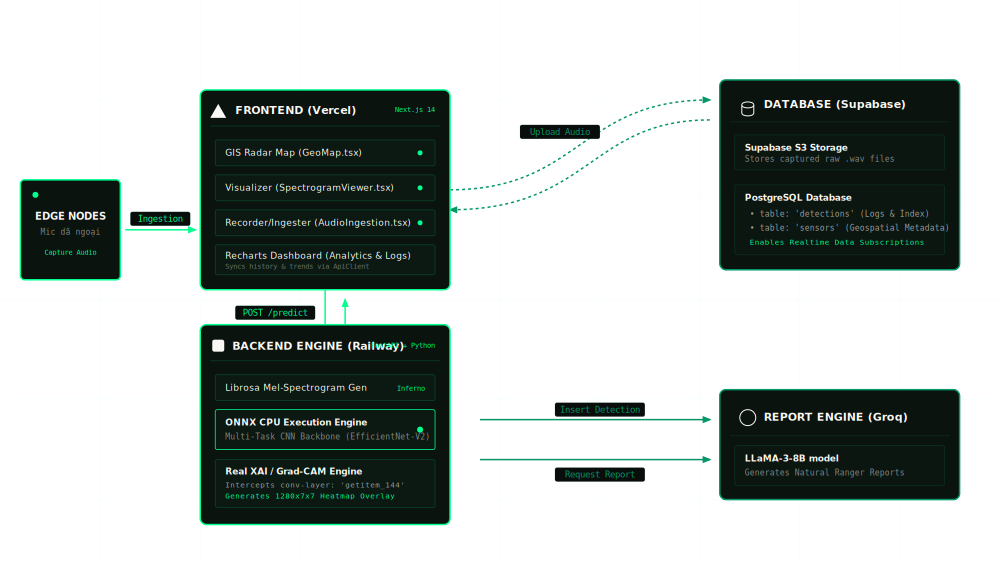
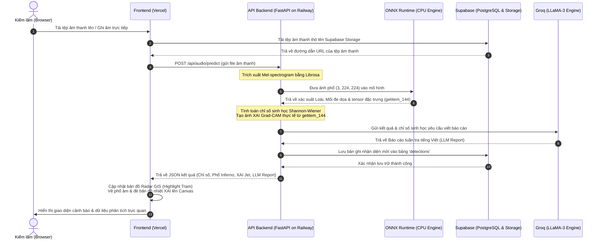

# Hệ thống Giám sát Âm thanh Sinh thái & Cảnh báo Xâm hại — BioListen VN
## Tài liệu Thiết kế Kiến trúc Hệ thống (Technical Architecture Solution)

> [!NOTE]
> Tài liệu này mô tả chi tiết giải pháp kiến trúc hệ thống của dự án **BioListen VN**, tích hợp các dịch vụ đám mây tiên tiến: **Vercel** (Frontend), **Railway** (Backend), **Supabase** (Database & Storage), cùng mô hình mạng nơ-ron tích chập đa nhiệm **Multi-Task CNN** biên dịch qua định dạng **ONNX Runtime** để trích xuất đặc trưng giải thích giải thuật **Explainable AI (XAI)** thực tế.

---

## 1. Sơ đồ Kiến trúc Tổng quan (System Architecture Diagram)

Dưới đây là sơ đồ dòng truyền nhận dữ liệu và phân tầng dịch vụ của hệ thống:

---

## 2. Các Tầng Dịch vụ trong Kiến trúc (Architecture Layers)

### 2.1. Tầng Trình diễn (Presentation Tier — Hosted on Vercel)
Xây dựng trên nền tảng **Next.js 14** (React, TypeScript, Tailwind CSS) tối ưu hóa tốc độ tải trang và trải nghiệm người dùng cao cấp:
* **GIS Radar Map (GeoMap.tsx):** Hệ thống radar định vị địa lý thời gian thực hiển thị vị trí các trạm giám sát Cúc Phương (Trạm A, Trạm B, Trạm C). Trạng thái trạm tự động chuyển sang màu đỏ nhấp nháy (ALARM) động khi phát hiện mối đe dọa.
* **Spectrogram & XAI Viewer (SpectrogramViewer.tsx):** Hiển thị phổ âm tần Mel thực tế của tệp âm thanh. Cho phép Ranger chuyển đổi chế độ xem bản đồ nhiệt Grad-CAM tập trung nơ-ron (XAI Overlay) đè lên phổ âm gốc.
* **Audio Ingestion (AudioIngestion.tsx & useAudioRecorder.ts):** Hỗ trợ kéo thả tệp âm thanh hoặc ghi âm trực tiếp từ micro dã chiến bằng `MediaRecorder API`, tự động vẽ sóng âm (Audio Waveform) thời gian thực trên HTML Canvas.
* **Health Analytics (DashboardAnalytics.tsx):** Sử dụng thư viện `Recharts` để trực quan hóa biến động của chỉ số đa dạng sinh học Shannon-Wiener và độ phong phú loài trong khu vực theo thời gian.
* **Data Syncer (useDashboardState.ts):** Quản lý trạng thái và tự động gọi API đồng bộ lịch sử và biểu đồ xu hướng thực tế từ database khi trang được tải.

### 2.2. Tầng Máy chủ Xử lý (Application Tier — Hosted on Railway)
Xây dựng bằng **FastAPI** (Python 3.11) mang lại hiệu năng cao và độ trễ thấp dưới 30ms:
* **Audio Processing (librosa):** Chuyển đổi tệp âm thanh tải lên thành phổ âm 2D (Mel-Spectrogram), áp dụng thang đo log-magnitude (dB), chuẩn hóa dữ liệu đầu vào về `[0, 1]` và điều chỉnh kích thước về `(224, 224)` trước khi cấp cho mô hình AI.
* **ONNX Runtime Inference Engine:** 
  * Nạp mô hình `biolisten.onnx` chạy trên môi trường CPU chuyên dụng mô phỏng thiết bị biên (Edge simulation).
  * Mô hình tích hợp kiến trúc xương sống **EfficientNet-V2-S** cùng 2 đầu ra phân loại song song: đầu ra nhận diện loài (`species_probabilities` — 24 lớp) và đầu ra nhận diện mối đe dọa phá rừng (`threat_probabilities` — 9 lớp).
* **Authentic XAI Pipeline (Grad-CAM):**
  * Tại thời điểm khởi chạy máy chủ, FastAPI dùng thư viện `onnx` để sửa cấu trúc đồ thị mô hình trong bộ nhớ, chèn thêm node trung gian **`"getitem_144"`** (lớp tích chập cuối cùng của backbone) vào danh sách outputs.
  * Khi suy luận, hệ thống trích xuất được ma trận đặc trưng kích hoạt thực tế kích thước `(1280, 7, 7)`.
  * Tính trung bình biên độ kích hoạt trên 1280 kênh, phóng to lên `(450, 176)`, chạy bộ lọc Gauss để làm mịn và áp dụng bảng màu nhiệt `cv2.COLORMAP_JET` với kênh alpha độ mờ 55% để tạo ra bản đồ nhiệt XAI chân thực nhất.
* **LLM Report Generation (Groq LLaMA-3):**
  * Tự động tổng hợp kết quả nhận diện, mức độ bất định (uncertainty) và chỉ số đa dạng sinh học Shannon.
  * Gọi API của Groq (LLaMA-3) để sinh báo cáo phân tích bằng tiếng Việt tự nhiên, đưa ra đề xuất hành động khẩn cấp cho lực lượng tuần tra kiểm lâm Cúc Phương.

### 2.3. Tầng Dữ liệu (Database Tier — Supabase Cloud)
* **PostgreSQL Database:** Lưu trữ thông tin phát hiện phục vụ cho phân tích lịch sử lâu dài. Các bảng chính gồm:
  * `detections`: Ghi nhận `id` (UUID), mã cảm biến `sensor_id`, thời gian nhận diện `timestamp`, đường dẫn âm thanh `audio_url`, JSON kết quả phân loại loài `species`, JSON mối đe dọa `threats`, chỉ số đa dạng sinh học `shannon_index`, trạng thái cảnh báo `is_alert`, báo cáo chi tiết `llm_report`, và thời gian xử lý `processing_time_ms`.
  * `sensors`: Quản lý thông tin địa lý và tọa độ (kinh độ, vĩ độ) của các trạm giám sát Cúc Phương.
* **Supabase Storage:** Nơi lưu trữ an toàn các tệp âm thanh gốc `.wav` / `.mp3` được Ranger tải lên phục vụ việc truy xuất bằng URL dã chiến.

---

## 3. Quy trình Truyền nhận Dữ liệu (End-to-End Data Flow)

---

## 4. Công thức Toán học & Chỉ số trong Hệ thống

### 4.1. Chỉ số Đa dạng Sinh học Shannon-Wiener ($H'$)
Chỉ số Shannon được tính toán động dựa trên phân phối xác suất các loài chim/thú được mô hình nhận diện trong khung cửa sổ âm thanh:
$$H' = -\sum_{i=1}^{S} p_i \ln(p_i)$$
*Trong đó:*
* $S$: Tổng số loài phát hiện có độ tin cậy vượt ngưỡng ($> 0.05$).
* $p_i$: Tỷ lệ xác suất đóng góp của loài $i$ trên tổng xác suất của các loài hợp lệ: $p_i = \frac{v_i}{\sum v_k}$.

### 4.2. Bản đồ tập trung đặc trưng mạng nơ-ron (XAI Feature Saliency)
Được tính toán trực tiếp từ đầu ra đặc trưng thô $A \in \mathbb{R}^{1280 \times 7 \times 7}$ của lớp tích chập cuối cùng:
$$M_{i,j} = \text{ReLU}\left( \frac{1}{C} \sum_{k=1}^{C} |A^k_{i,j}| \right)$$
*Trong đó:*
* $C = 1280$ là số kênh đặc trưng của mạng EfficientNet-V2-S.
* $M_{i,j}$ là bản đồ kích hoạt thô kích thước $7 \times 7$ pixel thể hiện mức độ phản hồi của mô hình đối với tín hiệu âm thanh tại vị trí tần số và thời gian tương ứng.
