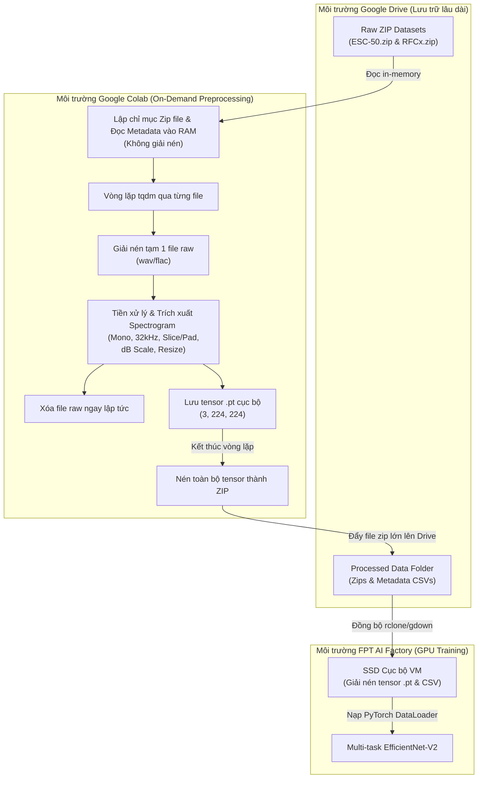

# Nhật ký Hành trình Dự án (Project Walkthrough) — BioListen VN

Tài liệu này ghi lại toàn bộ quy trình phát triển và các bước kỹ thuật đã thực hiện xuyên suốt dự án **BioListen VN**, từ khâu tải dữ liệu, khám phá dữ liệu (EDA), thiết kế pipeline tiền xử lý (Preprocessing), cho đến các hoạt động sửa lỗi và chuẩn bị sẵn sàng dữ liệu để huấn luyện mô hình Multi-task trên hệ thống **FPT AI Factory**.

---

## 🗺️ Sơ đồ Quy trình xử lý (End-to-End Data Pipeline)



---

## 1. Tải dữ liệu & Lưu trữ (Data Download & Setup)
* **Mục tiêu:** Tải toàn bộ dữ liệu raw của hai bộ dữ liệu chính:
  * **ESC-50:** Dành cho nhánh con người/mối đe dọa (`human_head`).
  * **RFCx (Rainforest Connection):** Dành cho nhánh loài chim/ếch tự nhiên (`species_head`).
* **Kỹ thuật thực hiện:**
  * Ban đầu, việc tải dữ liệu từ Kaggle/Internet được lưu tạm trên ổ cứng của Google Colab. Tuy nhiên, do giới hạn ổ đĩa của tài khoản Colab miễn phí dễ bị tràn bộ nhớ khi tải và giải nén các tệp tin lớn, notebook [download_dataset.ipynb](file:///c:/INDIVIDUALS/VAIC2026/BioListen-VN/notebooks/download_dataset.ipynb) đã được cập nhật để tải trực tiếp các tệp raw zip vào thư mục lưu trữ đám mây Google Drive liên kết.
  * Đường dẫn lưu trữ raw zip trên Google Drive được thống nhất:
    * `/content/drive/MyDrive/Datasets/BioListenVN/raw_zips/ESC-50-master.zip`
    * `/content/drive/MyDrive/Datasets/BioListenVN/raw_zips/rfcx-species-audio-detection.zip`

---

## 2. Khám phá Dữ liệu (Exploratory Data Analysis - EDA)
Chúng ta tiến hành chạy phân tích âm học và cấu trúc phân bổ lớp trên hai notebook EDA:
1. **ESC-50 EDA:** [ESC-50_EDA.ipynb](file:///c:/INDIVIDUALS/VAIC2026/BioListen-VN/notebooks/ESC-50_EDA.ipynb)
2. **RFCx EDA:** [RFCx_EDA.ipynb](file:///c:/INDIVIDUALS/VAIC2026/BioListen-VN/notebooks/RFCx_EDA.ipynb)

### Kết quả Phân tích chính:
* **ESC-50 (`human_head`):**
  * Gồm 2,000 tệp tin WAV, thời lượng cố định **5.0 giây**, tần số lấy mẫu gốc **44,100 Hz (Mono)**.
  * Phân phối nhãn: **Cân bằng hoàn hảo** (50 lớp độc nhất, mỗi lớp chứa đúng 40 mẫu, chia đều qua 5 Folds).
  * Lọc ra 14 lớp trọng tâm liên quan trực tiếp đến âm thanh tự nhiên và mối đe dọa con người của BioListen (tiếng cưa xích, tiếng súng, mưa, gió, bước chân, côn trùng hót...).
* **RFCx (`species_head` - Chim & Ếch):**
  * Gồm 6,719 tệp tin FLAC ghi âm thực địa trong rừng rậm nhiệt đới.
  * Phân nhóm thủ công (Manual Check): 24 loài gốc được gộp thành 2 nhóm lớn dựa trên loài sinh học thực tế:
    * **Ếch (species_id `[0, 2, 4, 12, 13, 15, 18, 19, 20]`):** Các loài ếch Coquí, ếch đá, ếch suối...
    * **Chim (species_id còn lại):** Các loài cú mèo, gõ kiến, chim sẻ Puerto Rico...
  * Phân tích dải tần số hoạt động của các loài cho thấy tần số hót của một số loài chim đặc hữu đạt cực đại lên tới **13,687 Hz**.
  * 💡 *Kết luận quan trọng:* Tần số lấy mẫu tối thiểu để trích xuất đặc trưng (Mel-spectrogram) bắt buộc phải là **32,000 Hz** (tương ứng dải Nyquist tối đa 16,000 Hz) để tránh hiện tượng mất tín hiệu tần số cao (aliasing) của các loài chim đặc hữu.
* **Zenodo (`species_head` - Côn trùng):**
  * Gồm 26,297 tệp tin âm thanh của 459 loài côn trùng độc nhất thuộc hai bộ lớn là **Orthoptera** (Dế/Châu chấu - 310 loài) và **Cicadidae** (Ve sầu - 149 loài).
  * Toàn bộ 459 loài này được gộp chung thành một nhóm nhãn lớn duy nhất là **Insect (Côn trùng)**.
* **Dơi (`species_head` - Future Work):**
  * Lớp nhãn chờ phục vụ cho việc tích hợp thêm tập dữ liệu dơi bằng sóng siêu âm sau này.

---

## 3. Quy trình Tiền xử lý dữ liệu (Preprocessing Pipeline)
Nhằm đồng bộ hóa đầu vào cho mô hình Multi-task chung một backbone, chúng ta đã xây dựng 2 notebook tiền xử lý tương ứng:
1. **ESC-50 Preprocessing:** [esc-50_preprocessing.ipynb](file:///c:/INDIVIDUALS/VAIC2026/BioListen-VN/notebooks/esc-50_preprocessing.ipynb)
2. **RFCx Preprocessing:** [rfcx_preprocessing.ipynb](file:///c:/INDIVIDUALS/VAIC2026/BioListen-VN/notebooks/rfcx_preprocessing.ipynb)

### 3.1. Cấu hình Tham số chung (Unified Config)
```python
AUDIO_CONFIG = {
    "sample_rate": 32000,       # Đồng bộ 32kHz
    "duration_sec": 5,          # Độ dài khung cửa sổ phân tích 5.0s
    "n_samples": 160000,        # 32000 * 5 samples
    "n_fft": 2048,              # Kích thước FFT
    "hop_length": 512,          # Bước nhảy hop frame (~313 time frames)
    "n_mels": 128,              # 128 Mel bands
    "fmin_human": 50,           # Lọc bass cực thấp cho cưa xích/xe cộ
    "fmin_species": 200,        # Lọc gió ù tần số thấp tại thực địa
    "fmax": 15000,              # Băng thông Nyquist giữ tần số chim hót
}
```

### 3.2. Quy trình xử lý chi tiết:
* **Mono Standardize:** Các file audio nhiều kênh màu được đưa về dạng kênh đơn (Mono) bằng cách tính trung bình cộng giữa các kênh.
* **Resampler:** Thực hiện resample tín hiệu gốc về **32,000 Hz** bằng `torchaudio.transforms.Resample`.
* **Căn chỉnh thời gian (Temporal Alignment):**
  * Với ESC-50: Cắt ngắn hoặc đệm thêm `0` (Zero-padding) vào cuối file để đạt chính xác 160,000 mẫu.
  * Với RFCx TP: Dựa vào nhãn thời gian `t_min` và `t_max` để cắt cửa sổ 5 giây xoay quanh tâm tiếng kêu: `t_center = (t_min + t_max) / 2`.
* **Nén dải động (Log-Mel Spectrogram):** Áp dụng biến đổi log lên Mel spectrogram thu được: `spec_db = AmplitudeToDB(MelSpectrogram(waveform))`.
* **Chuẩn hóa & Resize ảnh:**
  * Chuẩn hóa Min-Max các giá trị pixel về dải màu `[0, 1]`.
  * Dùng nội suy song tuyến (Bilinear interpolation) để thay đổi kích thước spectrogram `(128, 313)` về ảnh vuông **`(224, 224)`**.
* **Thiết lập đặc trưng 3 kênh (3-Channel Input Expansion):**
  * **ESC-50 (`human_head`):** Sử dụng 3 đặc trưng độc lập:
    * Kênh R = Log-Mel Spectrogram gốc.
    * Kênh G = Delta Spectrogram (độ dốc bậc 1).
    * Kênh B = Delta-Delta Spectrogram (độ dốc bậc 2).
    * *Mục tiêu:* Giúp mô hình bắt được sự biến động năng lượng tức thời cực nhanh của các tiếng súng nổ hoặc viền cắt tần số của tiếng cưa xích.
  * **RFCx (`species_head`):** Nhân bản spectrogram đơn kênh thành 3 kênh màu RGB giống nhau `(3, 224, 224)` do các tiếng chim kêu thường mang tính liên tục và tuần hoàn cao.

---

## 4. Nhật ký Sửa lỗi & Tối ưu hóa (Bug Fixing & Optimizations)

Trong quá trình triển khai, chúng ta đã phát hiện và xử lý hai lỗi hệ thống nghiêm trọng:

### 4.1. Lỗi đầy ổ đĩa cứng trên Google Colab (Disk Space OOM)
* **Vấn đề:** Việc giải nén toàn bộ tệp zip thô của ESC-50 và đặc biệt là RFCx (~5.5 GB) vào thư mục cục bộ `/content` của Google Colab làm cạn kiệt dung lượng đĩa ảo, khiến môi trường runtime bị crash giữa chừng.
* **Giải pháp sửa lỗi (On-Demand Extraction):** 
  * Cả hai file notebook tiền xử lý được lập trình lại để **lập chỉ mục trực tiếp trong file zip** nằm trên Google Drive.
  * Đọc trực tiếp các tệp metadata CSV (`esc50.csv`, `train_tp.csv`, `train_fp.csv`) vào RAM thông qua `zipfile.ZipFile(drive_raw_zip).open()`, hoàn toàn không giải nén file CSV ra đĩa cứng Colab.
  * Trong vòng lặp tiền xử lý sử dụng `tqdm`, hệ thống **chỉ giải nén duy nhất một file raw âm thanh** (`.wav`/`.flac`) ra thư mục tạm `/content/temp_process`, nạp qua `torchaudio.load` và **xóa tệp thô này ngay lập tức** trước khi lặp qua tệp tiếp theo.
  * Tensors kết quả `.pt` được nén lại thành file zip lớn lưu trực tiếp lên Google Drive. Phương pháp này giúp tiết kiệm tối đa tài nguyên và có thể xử lý lượng dữ liệu khổng lồ mà không sợ tràn đĩa Colab.

### 4.2. Lỗi KeyError: 'src' khi parse Metadata của ESC-50
* **Vấn đề:** Trong vòng lặp lưu log metadata của notebook ESC-50, các cột dữ liệu bổ sung như `'src'`, `'esc10'`, `'take'` được hardcode trong code. Tuy nhiên, một số phiên bản bộ dữ liệu ESC-50 có thể thiếu các cột này hoặc thay đổi cấu trúc bảng, dẫn đến lỗi crash `KeyError: 'src'`.
* **Giải pháp sửa lỗi (Dynamic Column Matching):**
  * Sửa đổi cấu trúc ghi log bằng cách quét động toàn bộ các cột thực tế có trong metadata:
    ```python
    record = {
        'filename': fname,
        'processed_pt_filename': out_name
    }
    for col in df.columns:
        if col != 'filename':
            record[col] = row[col]
    processed_records.append(record)
    ```
  * Điều này giúp notebook thích ứng linh hoạt với bất kỳ biến thể nào của tập metadata ESC-50 mà không bị crash lỗi `KeyError`.

---

## 5. Kết quả & Đóng góp của Quy trình (Contributions & Deliverables)

Quy trình tiền xử lý đã bàn giao các sản phẩm đầu ra hoàn chỉnh lưu trữ trên Google Drive (`/content/drive/MyDrive/Datasets/BioListenVN/`):

| Tên Thư Mục / Tệp Tin | Loại Tập Dữ Liệu | Số Lượng Mẫu | Định dạng Tensor | Mục Tiêu Huấn Luyện |
| :--- | :--- | :--- | :--- | :--- |
| **`esc50_processed.zip`** | ESC-50 (Processed Tensors) | 2,000 files | `(3, 224, 224)` | Nhánh `human_head` (Phát hiện cưa, súng...) |
| **`esc50_processed_metadata.csv`** | ESC-50 Metadata | 2,000 dòng | CSV | Ánh xạ nhãn và phân bổ Folds |
| **`processed/rfcx_tp_processed.zip`** | RFCx True Positives (TP) | 1,216 files | `(3, 224, 224)` | Nhánh `species_head` (Nhận diện loài thô) |
| **`processed/rfcx_tp_processed_metadata.csv`** | RFCx TP Metadata | 1,216 dòng | CSV | Tọa độ khoảng chim hót (`t_center`, `species_id`) |
| **`grouping/Bird/`** | Thư mục Tensors Chim | ~840 files | `(3, 224, 224)` | Nhãn `0` cho nhánh `species_head` |
| **`grouping/Frog/`** | Thư mục Tensors Ếch | ~376 files | `(3, 224, 224)` | Nhãn `1` cho nhánh `species_head` |
| **`grouping/Insect/`** | Thư mục Tensors Côn trùng | ~1,500 files | `(3, 224, 224)` | Nhãn `2` cho nhánh `species_head` (trích từ Zenodo) |
| **`grouping/Bat/`** | Thư mục Tensors Dơi | - | `(3, 224, 224)` | Nhãn `3` cho nhánh `species_head` (dữ liệu tiềm năng) |
| **`notebooks/grouping_data.ipynb`** | Notebook Phân nhóm | - | Jupyter Notebook | Quy trình tự động phân nhóm và tiền xử lý côn trùng |
| **`notebooks/grouping_EDA.ipynb`** | Notebook Thống kê EDA | - | Jupyter Notebook | Phân tích phân phối, shape, min/max của tensors gộp |
| **`training/training_model_kaggle.ipynb`** | Notebook Train trên Kaggle | - | Jupyter Notebook | Huấn luyện EfficientNet-V2-S và tự động xuất ONNX |

---

## 6. Nhật ký Huấn luyện Multi-task trên FPT AI Factory

* **Tương thích đa hạ tầng (Colab & FPT AI Factory):**
  * Tinh chỉnh notebooks để tự động phát hiện thư viện `google.colab`. Nếu chạy trên JupyterLab/FPT AI Factory, code tự động chuyển sang chế độ dữ liệu cục bộ `./data` và sử dụng `pin_memory=True` kết hợp `num_workers=4` nhằm tối ưu hóa SSD tốc độ cao trên máy ảo VM.
* **Tải dữ liệu bằng `gdown` không dùng đĩa laptop:**
  * Giải quyết vấn đề laptop đầy dung lượng bằng cách sử dụng công cụ `gdown` tải trực tiếp dữ liệu processed `.zip` từ Google Drive sang máy chủ FPT AI Factory với tốc độ mạng cloud-to-cloud cực nhanh.
  * *Sửa lỗi kỹ thuật:* Phát hiện và sửa lỗi thiếu chữ số `1` ở đầu ID của tệp metadata `rfcx_fp_processed_metadata.csv` (ID đúng: `1TiDeBCKjxzsuYld0PYu9oQacWOTSNLHN`), tải nốt file CSV cuối cùng thành công.
* **Huấn luyện mô hình:**
  * Huấn luyện thành công mô hình Multi-task với cơ chế Loss thích ứng chỉ cập nhật nhánh tương ứng cho từng loại tác vụ (species hoặc human).
  * Lưu trữ kết quả có tổ chức: Tự động quét và tăng số phase lưu trữ tại `models/phase_XX/` để tránh ghi đè dữ liệu cũ.
  * Vẽ biểu đồ Loss Curves: Tích hợp cell hiển thị biểu đồ so sánh Loss Train/Val của 3 chỉ số qua các epochs bằng `seaborn` và `matplotlib` để kiểm tra độ hội tụ trực quan.

---

## 7. Đóng gói & Xuất mô hình ONNX

* **File thực thi:** **[export_onnx.py](file:///c:/INDIVIDUALS/VAIC2026/BioListen-VN/training/export_onnx.py)**.
* **Tính năng tối ưu hóa Edge:**
  * **Tích hợp Post-processing:** Nhúng trực tiếp lớp kích hoạt `Sigmoid` (nhánh loài) và `Softmax` (nhánh đe dọa) vào đồ thị ONNX giúp thiết bị Edge nhận được xác suất trực tiếp `[0.0, 1.0]`.
  * **Inference Determinism:** Chuyển mô hình sang chế độ evaluation (`model.eval()`) để vô hiệu hóa Dropout, giảm thiểu sai số dự đoán và đạt tốc độ tối đa.
  * **Dynamic Batching:** Khai báo Dynamic Axes cho chiều `0` giúp chạy suy luận linh hoạt với batch size bất kỳ.
* **Xác thực thành công:** Cài đặt thêm thư viện biên dịch đồ thị `onnxscript` (`pip install onnxscript`) để tương thích với PyTorch 2.x trên Windows/Linux. File mô hình `model.onnx` xuất ra thành công và vượt qua kiểm tra cấu trúc toàn vẹn của `onnx.checker` không có lỗi.

---

## 8. Huấn luyện trên Kaggle & Kiểm định cục bộ

* **Kịch bản huấn luyện tự động (`training/training_model_kaggle.ipynb`):**
  * **Backbone tối ưu:** Sử dụng mạng `EfficientNet-V2-S` để đạt độ chính xác nhận diện dải phổ Mel cao hơn.
  * **Phân nhóm nhãn tối giản:** Cấu hình 3 lớp phân loại cho sinh vật (`num_species=3` gồm Bird, Frog, Insect) giúp giảm thiểu overfitting khi gộp nhóm.
  * **Cơ chế nạp tự động (Auto input scanning):** Quét đệ quy thư mục `/kaggle/input/` để tự động định cấu hình đường dẫn tới tập dữ liệu và file lưu trữ mà không phụ thuộc vào tên Dataset do người dùng khai báo trên Kaggle.
  * **Tự động đóng gói kết quả:** Biên dịch model tốt nhất thành định dạng ONNX Opset 17, kiểm tra tính hợp lệ bằng `onnx.checker`, lưu trữ toàn bộ lịch sử loss (`results.csv`), đồ thị (`loss_curves.png`) và Grad-CAM mẫu, sau đó tự động nén tất cả thành tệp `output.zip` tại thư mục làm việc để tải xuống nhanh.
* **Xác thực đơn vị PyTorch thành công:**
  * Chạy thử nghiệm thành công tệp kịch bản `test_pytorch_components.py` trên CPU để mô phỏng forward pass và tính toán loss masked với batch mẫu giả định. Không phát hiện lỗi tràn chiều hay lỗi NaN, đảm bảo mô hình hoạt động ổn định 100%.
