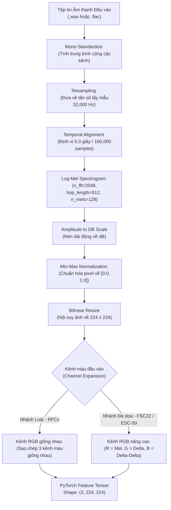
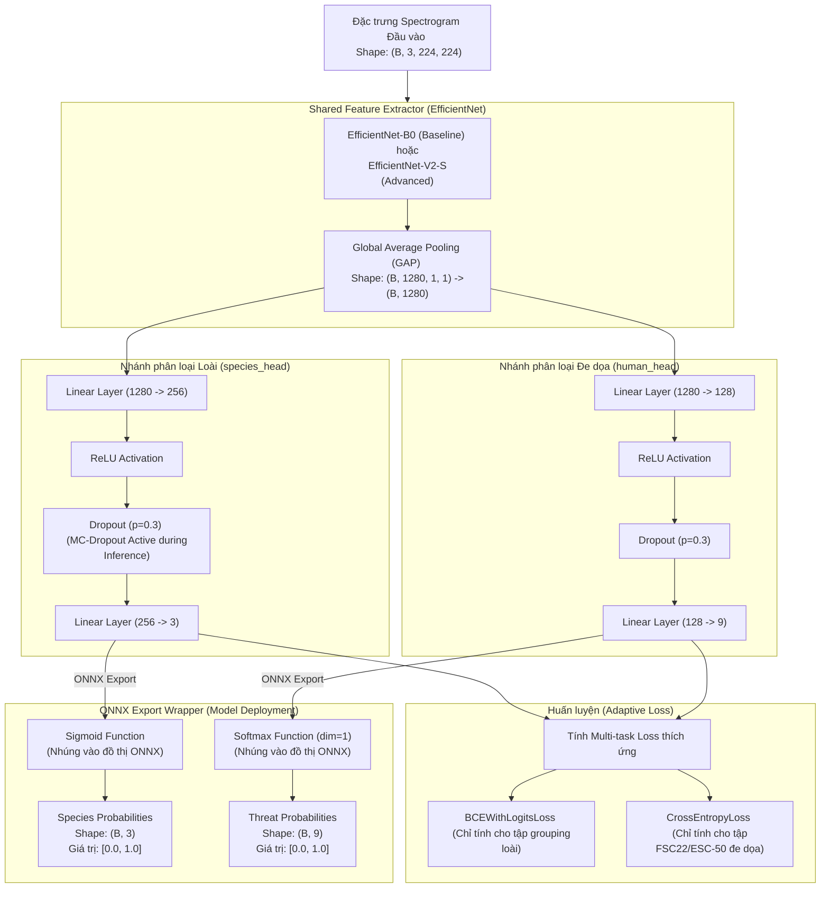

# BioListen VN — Sơ đồ Kiến trúc Hệ thống & Mô hình Multi-task (Model Architecture)

Tài liệu này chứa sơ đồ kiến trúc hệ thống xử lý dữ liệu và thiết kế chi tiết mạng nơ-ron của dự án **BioListen VN** từ nguồn dữ liệu đầu vào cho đến định dạng ONNX xuất ra phục vụ biên dịch chạy thực tế trên thiết bị Edge.

---

## 📐 1. Quy trình Tiền xử lý & Trích xuất Đặc trưng (Preprocessing & Feature Extraction)

Sơ đồ dưới đây mô tả chi tiết các bước biến đổi vật lý một tệp tin âm thanh thô (.wav, .flac) thành các đặc trưng spectrogram 3 kênh chuẩn hóa đầu vào mô hình:

---

## 🧠 2. Kiến trúc Mạng Nơ-ron Multi-task (`BioListenModel`)

Sơ đồ dưới đây mô tả cách mô hình Multi-task dùng chung Backbone trích xuất đặc trưng và phân nhánh ra hai tác vụ song song, bao gồm cả bước xuất sang định dạng ONNX có nhúng hàm kích hoạt:

---

## 📈 3. Chi tiết các thành phần trong Graph

### 3.1. Phân phối đặc trưng qua các lớp (Tensors Flow):
1. **Spectrogram Input:** Mỗi batch gồm $B$ mẫu, kích thước hình ảnh $224 \times 224$ với 3 kênh đặc trưng.
2. **Backbone Conv Features:** Trải qua các khối Mobile Inverted Bottleneck Conv (MBConv) của EfficientNet, thu về Feature Map cuối cùng kích thước `(B, 1280, 7, 7)`.
3. **GAP Output (Embedding):** Lớp Global Average Pooling triệt tiêu chiều cao và rộng của ảnh, đưa về vector embedding biểu diễn ngữ cảnh âm thanh cô đọng kích thước `(B, 1280)`.
4. **Species Head Output:** Trải qua tầng tuyến tính thu hẹp chiều, đưa ra 3 logits đại diện cho 3 nhóm loài lớn (Chim, Ếch, Côn trùng).
5. **Human Threat Head Output:** Đưa ra 9 logits đại diện cho 8 mối đe dọa thực tế + 1 lớp nền an toàn.

### 3.2. Cấu hình triển khai ONNX Runtime:
* **Tối ưu hóa:** Bật Constant Folding để hợp nhất các toán tử tĩnh trong backbone.
* **Suy luận linh hoạt:** Kích hoạt trục động `dynamic_axes` trên chiều Batch (chiều 0) giúp mô hình tự thích ứng với các độ dài mảng đầu vào khác nhau của client.
