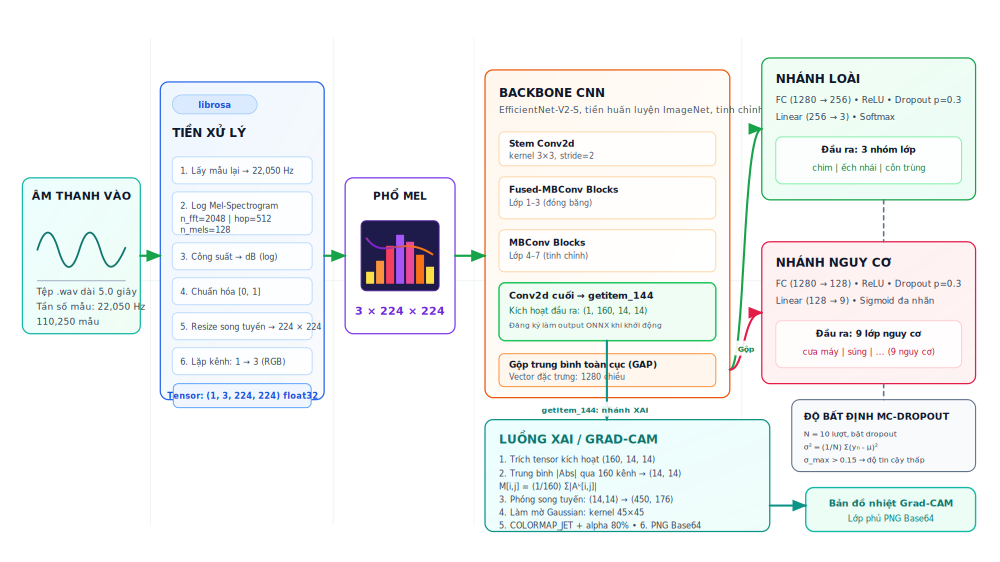

# Đặc tả Kiến trúc Mô hình Học sâu & Giải thuật XAI — BioListen VN

> [!NOTE]
> Tài liệu này thuyết minh chi tiết mô hình học sâu **Multi-Task CNN** của dự án **BioListen VN** (suy luận biên dựa trên định dạng **ONNX Runtime**), bao gồm các khâu tiền xử lý tín hiệu âm thanh, sơ đồ cấu trúc các tầng nơ-ron, giải thuật giải thích mô hình **Grad-CAM (XAI)** thực tế, và cơ chế định lượng độ bất định **MC-Dropout**.

---

## 1. Sơ đồ Kiến trúc Mô hình (Model Architecture Diagram)

Dưới đây là sơ đồ chi tiết dòng lan truyền tín hiệu (forward pass) và trích xuất đặc trưng giải thích trong mô hình:

---

## 2. Tiền xử lý & Trích xuất Đặc trưng Âm thanh (Audio Pipeline)

Tín hiệu âm thanh captured từ thực địa sẽ đi qua chuỗi xử lý sau:
1. **Chuẩn hóa tần số (Resampling):** Đưa tần số lấy mẫu về chuẩn **22,050 Hz** (tiêu chuẩn phân tích âm thanh sinh học rừng dã ngoại).
2. **Cắt khung thời gian (Windowing):** Phân đoạn âm thanh thành các khung độ dài cố định **5.0 giây** (tương đương $110,250$ mẫu số hóa).
3. **Phổ âm tần Mel (Mel-Spectrogram):**
   * Sử dụng thuật toán Biến đổi Fourier nhanh (FFT) với kích thước cửa sổ $N_{\text{FFT}} = 2048$.
   * Độ bước nhảy giữa các khung $Hop\_length = 512$ mẫu.
   * Số lượng băng tần Mel $N_{\text{Mels}} = 128$.
4. **Log-Magnitude (dB):** Chuyển đổi công suất âm sang thang đo dB: $S_{\text{dB}} = 10 \log_{10}(S_{\text{Mel}} + 10^{-9})$ để mô phỏng chính xác thính giác sinh học.
5. **Đồng bộ Kích thước & Kênh (RGB Formatting):**
   * Chuẩn hóa biên độ năng lượng về đoạn `[0, 1]`.
   * Nội suy kích thước ảnh phổ từ thô về ảnh kích thước chuẩn mạng CNN `(224, 224)`.
   * Lặp kênh tín hiệu $1 \rightarrow 3$ (RGB) để tương thích với đầu vào mặc định của mạng xương sống.

---

## 3. Mạng Nơ-ron Tích chập Đa nhiệm (Multi-Task CNN)

Mô hình hoạt động trên nguyên lý **Multi-Task Learning**, chia sẻ chung mạng xương sống (Backbone) trích xuất đặc trưng và phân nhánh ở các đầu phân loại:

### 3.1. Xương sống mạng (Backbone — EfficientNet-V2-S)
* Sử dụng kiến trúc **EfficientNet-V2-S** đã huấn luyện trước trên tập dữ liệu lớn ImageNet để chuyển giao tri thức (Transfer Learning).
* Đóng băng các tầng tích chập sơ khởi (Layers 1-5) để giữ lại các bộ lọc hình học cơ bản, chỉ huấn luyện (Fine-tune) các khối tích chập cuối và 2 đầu ra.

### 3.2. Đầu phân loại Loài (Species Head)
Nhận diện tiếng kêu đặc trưng theo 3 nhóm sinh vật chỉ thị chính:
$$\text{Logits}_{\text{species}} = W_2 \cdot \text{ReLU}(W_1 \cdot x + b_1) + b_2$$
* Gồm 1 tầng Fully-Connected ($1280 \rightarrow 256$), hàm kích hoạt ReLU, kết hợp tầng Dropout chống quá khớp tỉ lệ $0.3$.
* Tầng đầu ra kích thước $3$ (ứng với 3 nhóm sinh vật: 0: Chim, 1: Ếch nhái, 2: Côn trùng), đi qua hàm **Softmax** để lấy phân phối xác suất.
* *Lưu ý (Lộ trình tương lai):* Hiện tại mô hình phân loại ở cấp độ nhóm động vật chỉ thị chính để tối ưu hóa hiệu năng tính toán trên thiết bị biên. Trong tương lai, mô hình sẽ được mở rộng huấn luyện để phân biệt chi tiết từng loài sinh học cụ thể (individual species level).

### 3.3. Đầu nhận diện Mối đe dọa (Threat Head)
Phát hiện tạp âm nhân tạo xâm hại rừng (tiếng cưa xích phá rừng, tiếng súng săn bắn trộm):
* Cấu trúc gồm tầng ẩn FC $128$ và tầng đầu ra kích thước $9$ (ứng với 9 loại âm thanh bất thường, bao gồm cưa xích, súng săn, và tạp âm nền).
* Sử dụng hàm **Sigmoid** ở đầu ra để cho phép nhận diện đa nhãn (Multi-label) trong trường hợp có nhiều mối đe dọa diễn ra đồng thời.

---

## 4. Cơ chế Giải thích mô hình XAI (Grad-CAM Pipeline)

Vì mô hình chạy trên CPU thông qua **ONNX Runtime** không hỗ trợ tính toán Lan truyền ngược (Backpropagation gradients), hệ thống sử dụng cơ chế trích xuất ma trận kích hoạt nơ-ron trung gian:
1. **Tiêm đầu ra đồ thị (Graph Output Injection):** Tại thời điểm khởi động máy chủ, đồ thị mô hình ONNX được sửa đổi để đăng ký tensor **`"getitem_144"`** (đầu ra tích chập cuối cùng của backbone, trước lớp Pooling) thành một đầu ra hợp lệ.
2. **Tính toán Bản đồ nhiệt (Feature Activation Saliency):**
   * Lấy ma trận đặc trưng trung gian kích thước $(160, 14, 14)$ từ đầu ra `"getitem_144"` của ONNX.
   * Tính trung bình biên độ tuyệt đối trên 160 kênh đặc trưng:
     $$ActMap_{i,j} = \frac{1}{160} \sum_{k=1}^{160} |A^k_{i,j}|$$
   * Nội suy phóng to ma trận kích hoạt từ $(14, 14)$ lên $(450, 176)$ bằng thuật toán bilinear để khớp hoàn toàn với tọa độ phổ hiển thị của tín hiệu âm thanh.
   * Chạy bộ lọc Gaussian với nhân kích thước $45 \times 45$ để làm mịn vùng hội tụ nơ-ron và áp dụng bảng màu `cv2.COLORMAP_JET` kết hợp mặt nạ kênh alpha trong suốt (độ mờ 80% tại vùng nóng > 50) giúp kiểm lâm quan sát trực quan nguồn phát âm thanh.

---

## 5. Định lượng độ bất định (MC-Dropout)

Nhằm giảm thiểu tỷ lệ báo động giả (False Alarm) do nhiễu thời tiết dông bão hoặc tiếng ồn lạ, mô hình áp dụng kỹ thuật **Monte Carlo Dropout**:
1. Giữ các tầng Dropout ở chế độ **Active** cả trong pha suy luận (Inference phase).
2. Thực hiện $N = 10$ lượt suy luận song song (forward passes) trên cùng một tệp âm thanh.
3. Tính toán phương sai (Standard Deviation - $\sigma$) của phân phối xác suất đầu ra:
   $$\sigma^2 = \frac{1}{N} \sum_{n=1}^{N} (y_n - \mu)^2$$
4. Nếu $\sigma_{\text{max}} > 0.15$, hệ thống tự động đánh dấu kết quả ở trạng thái **"Độ bất định cao" (Low Confidence)** để kiểm lâm lưu ý giám sát từ xa thay vì xuất kích khẩn cấp vô ích.
