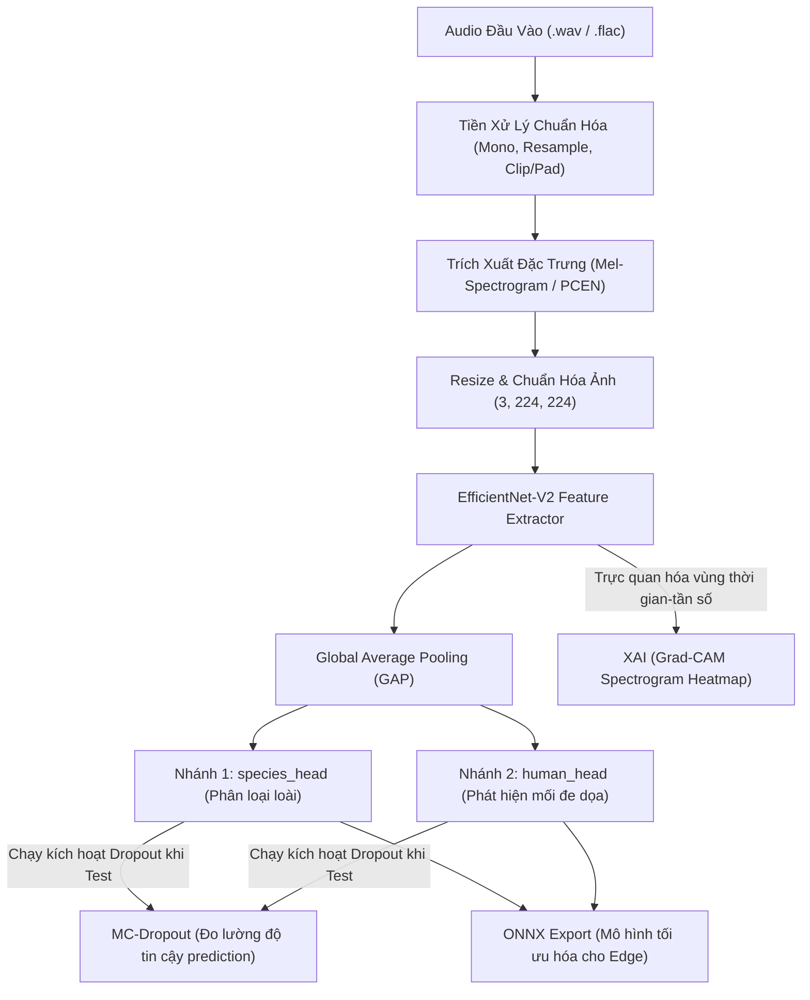

# BioListen VN — Quy trình EDA, Tiền xử lý & Thiết kế Kiến trúc Mô hình

Tài liệu này phác thảo chi tiết báo cáo kết quả khám phá dữ liệu (EDA), pipeline tiền xử lý và thiết kế kiến trúc mô hình Multi-task phục vụ dự án **BioListen VN**.

---

## 📌 Sơ đồ luồng dữ liệu tổng quát (End-to-End Data Flow)



---

## 1. Báo cáo kết quả khám phá dữ liệu (EDA Report)

Chúng ta đã hoàn thành việc chạy phân tích và trực quan hóa dữ liệu trên các notebook EDA sử dụng cơ chế giải nén theo yêu cầu (On-Demand Extraction) nhằm tối ưu dung lượng ổ đĩa Google Colab. Dưới đây là các kết quả phân tích thực tế:

### 1.1. Thống kê & Phân phối nhãn (Class Distribution Analysis)

#### A. Bộ dữ liệu FSC22 (`human_head` - Tập dữ liệu chính)
* **Tổng số lượng mẫu:** 2,025 tệp tin định dạng WAV.
* **Đặc tính cân bằng:** **Cân bằng hoàn hảo (Perfectly Balanced)**. Gồm 27 lớp độc nhất, mỗi lớp chứa đúng 75 mẫu.
* **Các lớp mối đe dọa thực tế trọng tâm (8 lớp):** `Fire`, `Chainsaw`, `Handsaw`, `Helicopter`, `VehicleEngine`, `Axe`, `Gunshot`, `Footsteps`.
* **Lớp nền (Background):** 19 lớp còn lại trong FSC22 (ví dụ: Rain, Wind, BirdChirping, Speak...) được gom chung thành nhãn thứ 9 tên là `background_normal`.

#### B. Bộ dữ liệu ESC-50 (`human_head` - Tập dữ liệu phụ trợ)
* **Tổng số lượng mẫu:** 2,000 tệp tin định dạng WAV.
* **Đặc tính cân bằng:** **Cân bằng hoàn hảo**. Gồm 50 lớp độc nhất (40 mẫu/lớp) chia đều qua 5 Folds.
* **Mục đích sử dụng:** Trích xuất các lớp tương ứng (`crackling_fire`, `chainsaw`, `hand_saw`, `helicopter`, `engine`, `footsteps`) làm dữ liệu phụ trợ giúp mô hình tăng cường độ chính xác cho 8 lớp threat chính, các lớp còn lại đóng vai trò là auxiliary background noise.

#### C. Bộ dữ liệu Anuraset (`species_head` - phụ trợ lưỡng cư)
* **Tổng quan:** Tập dữ liệu quy mô lớn gồm 27 giờ ghi âm thực địa PAM (Passive Acoustic Monitoring) được gán nhãn thủ công từ các chuyên gia, bao gồm 42 loài ếch/nhái Nam Mỹ (Neotropical).
* **Đặc tính:** Gồm các phân khúc 3 giây (~93,378 đoạn âm thanh ngắn). Thử thách lớn là sự xuất hiện đồng thời nhiều tiếng kêu của các loài khác nhau (multi-label overlap) và phân phối đuôi dài (long-tailed).
* **Mục đích:** Tăng cường tính đa dạng của dữ liệu nhận diện lưỡng cư cho `species_head`.

#### D. Bộ dữ liệu Zenodo - InsectSet459 (`species_head` - phụ trợ côn trùng)
* **Tổng quan:** Gồm 26,298 tệp tin ghi âm (khoảng 226.6 giờ) của 459 loài côn trùng độc nhất thuộc bộ Orthoptera (châu chấu, dế) và họ Cicadidae (ve sầu).
* **Đặc tính:** Sử dụng các dải tần số cực rộng và cao từ 8 kHz đến 500 kHz để ghi lại đầy đủ tiếng râm ran tần số siêu cao đặc thù của côn trùng.
* **Mục đích:** Hỗ trợ mô hình học các dải tần số cao và lọc nhiễu tiếng ồn của môi trường rừng tự nhiên.

---

### 1.2. Giải pháp kỹ thuật: Đọc tệp ZIP trực tiếp trên bộ nhớ (In-memory Zip-Reading)
Do bộ dữ liệu Anuraset và Zenodo (InsectSet459) có dung lượng giải nén cực lớn (Zenodo chứa hơn 26,000 file WAV phân tách trong 2 file zip lớn), việc tải và giải nén chúng ra đĩa cứng của Google Colab sẽ lập tức làm tràn đĩa ảo.
* **Giải pháp đã tối ưu hóa:** 
  * Cả hai file **[Anuraset_EDA.ipynb](file:///c:/INDIVIDUALS/VAIC2026/BioListen-VN/notebooks/Anuraset_EDA.ipynb)** và **[Zenodo_EDA.ipynb](file:///c:/INDIVIDUALS/VAIC2026/BioListen-VN/notebooks/Zenodo_EDA.ipynb)** được xây dựng bằng cơ chế đọc trực tiếp từ ZIP trên Google Drive qua RAM.
  * Đọc file metadata CSV directly từ ZIP thông qua lớp đệm `pandas` và `io.BytesIO`.
  * Khi thực hiện thống kê mẫu âm thanh hoặc vẽ Mel-spectrogram, hệ thống trích xuất nhị phân của duy nhất file đó thành một luồng byte trong RAM, chuyển tiếp thẳng đến thư viện xử lý âm thanh mà **hoàn toàn không ghi đè dữ liệu ra đĩa cứng cục bộ**, giúp sử dụng **0 MB** không gian lưu trữ local của Colab.


---

### 1.2. Phân tích Đặc tính vật lý & Chỉ số âm học (Physical & Acoustic Properties)

#### A. Bộ dữ liệu ESC-50
* **Tần số lấy mẫu (Sample Rate):** Toàn bộ tệp tin có SR cố định ở **44,100 Hz**.
* **Số kênh:** 1 kênh (**Mono**).
* **Thời lượng:** Đều có độ dài chính xác **5.0 giây**.

#### B. Bộ dữ liệu RFCx
* **Thời lượng tiếng kêu thực tế (`call_duration`):**
  * Giá trị trung bình (Mean): **2.54 giây** (Độ lệch chuẩn: 1.90 giây).
  * Phân vị 50% (Median): **1.86 giây**.
  * Phân vị 75% (75th Percentile): **3.34 giây**.
  * 💡 *Kết luận:* Cửa sổ phân tích tiêu chuẩn **5 giây** là hoàn toàn phù hợp để bao trọn bất kỳ tiếng kêu sinh học nào trong rừng rậm mà không sợ bị cắt cụt tín hiệu.
* **Dải tần số hoạt động (`f_min` & `f_max`):**
  * Tần số tối thiểu phát hiện (`f_min`): Bắt đầu từ dải tần rất thấp **93.75 Hz** (tiếng gió rì rào hoặc tiếng ù nền) đến trung bình **2,907 Hz**.
  * Tần số tối đa phát hiện (`f_max`): Trung bình đạt **6,043 Hz**, và đạt cực đại lên tới **13,687.5 Hz** (tiếng chim hót tần số cao).
  * 💡 *Kết luận:* **Bắt buộc phải sử dụng tần số lấy mẫu (Sample Rate) tối thiểu là 32,000 Hz** (hoặc giữ nguyên 44,100 Hz) cho pipeline trích xuất đặc trưng. Nếu hạ xuống 22,050 Hz (Nyquist = 11,025 Hz), toàn bộ dải tần số cao từ 11 kHz đến 13.6 kHz của một số loài chim đặc hữu sẽ bị triệt tiêu hoàn toàn (aliasing), làm giảm nghiêm trọng độ chính xác của mô hình nhận diện loài.

---

### 1.3. Trực quan hóa đặc trưng âm học tiêu biểu
* **Tiếng cưa xích (Chainsaw - ESC-50):** Biên độ sóng ổn định, năng lượng phân bố liên tục ở dải tần trung-thấp ($100\text{ Hz} - 4000\text{ Hz}$), tạo thành các dải sọc ngang liên mạch trên spectrogram.
* **Tiếng súng nổ (Gunshot - ESC-50):** Sóng âm đột biến biên độ cực lớn trong thời gian cực ngắn (<0.5 giây), năng lượng lan tỏa đều trên toàn bộ dải tần số dọc theo trục thời gian (biểu thị đặc trưng xung kích - transient).
* **Tiếng chim hót (Bird Call - RFCx):** Dạng sóng biến động tần số cực nhanh theo thời gian (frequency-modulated), tạo thành các đường vân cong uốn lượn rõ nét ở dải tần số cao ($3000\text{ Hz} - 10000\text{ Hz}$).

---

## 2. Thiết lập cấu hình tiền xử lý (Preprocessing Pipeline Configuration)

Dải dữ liệu và tham số cấu hình đã được kiểm chứng thông qua EDA và chuẩn hóa như sau:

### 2.1. Bộ tham số cấu hình thống nhất:
```python
AUDIO_CONFIG = {
    "sample_rate": 32000,       # Thống nhất 32kHz để dung hòa giữa Edge CPU và tần số Nyquist (16kHz)
    "duration_sec": 5,          # Thời lượng cửa sổ phân tích là 5 giây
    "n_samples": 32000 * 5,     # = 160,000 samples
    "n_fft": 2048,              # Kích thước cửa sổ FFT
    "hop_length": 512,          # Bước nhảy giữa các khung (time frames ~313 frames)
    "n_mels": 128,              # Số bộ lọc Mel
    "fmin_human": 50,           # Lọc tần số thấp cho nhánh con người (giữ bass động cơ)
    "fmin_species": 200,        # Lọc gió ù nền cho nhánh loài tự nhiên
    "fmax": 15000,              # Giữ dải tần số cao nhất của chim
}
```

### 2.2. Quy trình tiền xử lý chi tiết:
1. **Mono Standardize:** Chuyển đổi âm thanh nhiều kênh về kênh đơn (Mono) bằng cách tính trung bình cộng: `waveform = torch.mean(waveform, dim=0, keepdim=True)`.
2. **Resampler:** Thực hiện resample tín hiệu gốc về **32,000 Hz** bằng `torchaudio.transforms.Resample`.
3. **Temporal Alignment:** 
   * Nếu file âm thanh $> 5$ giây: Cắt ngẫu nhiên (lúc train) hoặc cắt chính giữa khoảng thời gian tiếng kêu đối với RFCx dựa trên `t_center = (t_min + t_max) / 2`.
   * Nếu file âm thanh $< 5$ giây: Đệm thêm số `0` (Zero padding) vào cuối file để đạt chính xác 160,000 samples.
4. **Log-Mel Spectrogram Extraction:** Trích xuất Mel-spectrogram thông qua `torchaudio` và nén dải động về decibel scale: `spec_db = AmplitudeToDB(MelSpectrogram(waveform))`.
5. **Min-Max Normalization:** Chuẩn hóa giá trị pixel về dải màu `[0, 1]` để phù hợp với phân phối ImageNet.
6. **Bilinear Resize & Channel Expansion:**
   * Sử dụng nội suy song tuyến (bilinear) để chuyển kích thước spectrogram `(128, 313)` về ảnh vuông `(224, 224)`.
   * Đối với `species_head`: Sao chép 1 kênh thành 3 kênh màu RGB: `(3, 224, 224)`.
   * Đối với `human_head` (Tùy chọn nâng cao): Sử dụng kênh R là Log-Mel Spectrogram, kênh G là Delta Spectrogram, kênh B là Delta-Delta Spectrogram để tăng cường khả năng nhận diện tiếng súng nổ (biến thiên năng lượng nhanh).

---

## 3. Kiến trúc mô hình Multi-task (`BioListenModel`)

Để tối ưu hóa tài nguyên phần cứng trên thiết bị Edge, mô hình sử dụng chung một Backbone trích xuất đặc trưng mạnh mẽ và chia thành hai nhánh dự đoán song song:

* **Backbone (Feature Extractor):** **EfficientNet-V2-S** (Pretrained ImageNet). Đóng băng các tầng tích chập ban đầu (early layers) để giữ lại các bộ lọc góc/cạnh, chỉ train các khối tích chập cuối cùng.
* **Global Average Pooling (GAP):** Chuyển đổi feature map cuối cùng thành một vector đặc trưng kích thước `(1280)`.
* **Nhánh 1 (`species_head`):**
  * Gồm tầng `Linear(1280, 256)` $\rightarrow$ `ReLU` $\rightarrow$ `Dropout(0.3)` $\rightarrow$ `Linear(256, N_SPECIES)`.
  * Output: Xác suất các loài chim/ếch tự nhiên (qua hàm Softmax).
* **Nhánh 2 (`human_head`):**
  * Gồm tầng `Linear(1280, 128)` $\rightarrow$ `ReLU` $\rightarrow$ `Linear(128, N_THREATS + 1)` (cộng 1 lớp cho nhãn "không đe dọa").
  * Output: Phát hiện tiếng cưa xích, tiếng súng, xe cộ.

---

## 4. Tính năng thông minh & Đánh giá tin cậy (XAI & MC-Dropout)

Trước khi đóng gói mô hình sang định dạng ONNX, hệ thống tích hợp hai tính năng quan trọng:

### 4.1. Giải thích mô hình bằng Grad-CAM (XAI)
* **Cơ chế:** Tính toán gradient của lớp tích chập cuối cùng thuộc backbone đối với điểm số dự đoán của lớp mục tiêu.
* **Biểu diễn:** Tạo ra một bản đồ nhiệt (heatmap) đè lên Mel-spectrogram gốc. Bản đồ này sẽ chỉ rõ **khu vực tần số nào và tại giây thứ mấy** khiến AI đưa ra quyết định phân loại (ví dụ: khoanh vùng dải tần cao biến động lúc chim hót hoặc dải tần rộng đột biến lúc súng nổ).

### 4.2. Định lượng độ bất định bằng MC-Dropout (Bayesian Uncertainty)
* **Cơ chế:** Trong quá trình suy luận (Inference), giữ cấu hình mô hình ở trạng thái `model.train()` để các tầng **Dropout** vẫn hoạt động. Chạy lan truyền xuôi (forward pass) liên tiếp $10 - 20$ lần cho cùng một mẫu đầu vào.
* **Đánh giá:**
  * Tính giá trị trung bình (Mean) làm kết quả dự đoán cuối cùng.
  * Tính độ lệch chuẩn (Standard Deviation - STD) giữa các lần chạy.
  * Nếu **STD vượt quá ngưỡng cho phép (ví dụ: > 0.15)**, hệ thống sẽ đánh dấu mẫu này là "Độ tin cậy thấp" (Low Confidence) và chuyển tiếp về trung tâm giám sát thay vì tự động đưa ra cảnh báo sai.

---

## 5. Tối ưu hóa suy luận bằng ONNX Export

Để đưa mô hình chạy thực tế trên thiết bị phần cứng giới hạn (Raspberry Pi đóng vai trò thiết bị Edge thu âm ngoài thực địa):
* **ONNX Export:** Xuất mô hình PyTorch hoàn chỉnh sang định dạng `.onnx` (`opset_version=17`) để tối ưu hóa đồ thị tính toán.
* **Edge Inference:** Chạy suy luận trực tiếp bằng **ONNX Runtime (CPU)** giúp giảm dung lượng mô hình, tăng tốc độ suy luận (latency dưới $100\text{ ms}$ cho mỗi cửa sổ 5 giây) và tiết kiệm điện năng tiêu thụ tại thực địa.

---

## 6. Nhật ký Tiền xử lý Dữ liệu (Preprocessing Execution Log)

Chúng ta đã tạo thành công và cấu hình 3 file Jupyter notebook phục vụ tiền xử lý trên môi trường Google Colab:
1. **FSC22 (nhánh `human_head` chính):** [fsc22_preprocessing.ipynb](file:///c:/INDIVIDUALS/VAIC2026/BioListen-VN/notebooks/fsc22_preprocessing.ipynb)
2. **ESC-50 (nhánh `human_head` phụ trợ):** [esc-50_preprocessing.ipynb](file:///c:/INDIVIDUALS/VAIC2026/BioListen-VN/notebooks/esc-50_preprocessing.ipynb)
3. **RFCx (nhánh `species_head`):** [rfcx_preprocessing.ipynb](file:///c:/INDIVIDUALS/VAIC2026/BioListen-VN/notebooks/rfcx_preprocessing.ipynb)

### 6.1. Quy trình Giải nén theo yêu cầu (On-Demand Extraction) & Tối ưu hóa Bộ nhớ
* **Vấn đề bộ nhớ:** Giải nén toàn bộ các file audio raw (đặc biệt là bộ RFCx ~5.5 GB) vào bộ nhớ cục bộ Colab có thể gây tràn đĩa cứng.
* **Giải pháp On-Demand:** 
  * Cả hai notebook đều đọc trực tiếp tệp CSV metadata (`esc50.csv`, `train_tp.csv`, `train_fp.csv`) từ tệp ZIP trong Google Drive vào RAM mà không giải nén ra ổ đĩa.
  * Lập chỉ mục (indexing) toàn bộ file âm thanh có trong ZIP để truy xuất nhanh.
  * Sử dụng vòng lặp kết hợp `tqdm` hiển thị tiến trình chi tiết. Trong mỗi bước lặp, hệ thống **chỉ giải nén duy nhất 1 file** audio raw tạm thời, tải lên thông qua `torchaudio.load()`, thực hiện tiền xử lý rồi **xóa ngay lập tức** file raw đó trước khi chuyển qua mẫu tiếp theo.
  * Tensors `.pt` đầu ra được gom cụm lưu trên local trước khi nén thành `.zip` duy nhất đưa lên Google Drive, dọn dẹp sạch sẽ ổ cứng sau khi kết thúc.

### 6.2. Quy trình & Định dạng Đầu ra (Outputs & Format)
* **FSC22 Preprocessing (Chính):**
  * Dữ liệu raw: `/content/drive/MyDrive/Datasets/BioListenVN/raw_zips/fsc22-v1.zip`
  * Dữ liệu processed: Lưu các tệp PyTorch tensor `.pt` có shape `(3, 224, 224)` biểu diễn spectrogram 3 kênh (R = Mel, G = Delta, B = Delta-Delta).
  * Output nén: `/content/drive/MyDrive/Datasets/BioListenVN/processed/fsc22_processed.zip`
  * Output Metadata: `/content/drive/MyDrive/Datasets/BioListenVN/processed/fsc22_processed_metadata.csv` (Ánh xạ file raw sang file `.pt` kèm theo Class Name và Class ID).
* **ESC-50 Preprocessing (Phụ trợ):**
  * Dữ liệu raw: `/content/drive/MyDrive/Datasets/BioListenVN/raw_zips/ESC-50-master.zip`
  * Dữ liệu processed: Tương tự định dạng `.pt` 3 kênh màu `(3, 224, 224)`.
  * Output nén: `/content/drive/MyDrive/Datasets/BioListenVN/processed/esc50_processed.zip`
  * Output Metadata: `/content/drive/MyDrive/Datasets/BioListenVN/processed/esc50_processed_metadata.csv`
* **RFCx Preprocessing:**
  * Dữ liệu raw: `/content/drive/MyDrive/Datasets/BioListenVN/raw_zips/rfcx-species-audio-detection.zip`
  * Dữ liệu processed: Cắt một cửa sổ 5 giây xoay quanh tâm thời điểm tiếng loài kêu `t_center = (t_min + t_max) / 2`, resample về 32kHz, lọc gió ù nền bằng $f_{\text{min}} = 200$ Hz, trích xuất Mel-spectrogram rồi nhân bản thành 3 kênh màu RGB `(3, 224, 224)` dưới dạng tệp `.pt`.
  * Output nén TP (True Positives): `/content/drive/MyDrive/Datasets/BioListenVN/processed/rfcx_tp_processed.zip`
  * Output Metadata TP: `/content/drive/MyDrive/Datasets/BioListenVN/processed/rfcx_tp_processed_metadata.csv`
  * Output nén FP (False Positives): `/content/drive/MyDrive/Datasets/BioListenVN/processed/rfcx_fp_processed.zip`
  * Output Metadata FP: `/content/drive/MyDrive/Datasets/BioListenVN/processed/rfcx_fp_processed_metadata.csv`
* **Dữ liệu phân nhóm đầu vào (BioListenVN/grouping/):**
  * Dữ liệu nguồn: Trích xuất và phân nhóm trực tiếp từ `rfcx_tp_processed.zip` (Chim, Ếch) và tiền xử lý in-memory từ `insect_Train.zip`/`insect_Validation.zip` (Côn trùng) thông qua script `notebooks/grouping_data.ipynb`.
  * Thư mục lưu trữ:
    * `/content/drive/MyDrive/Datasets/BioListenVN/grouping/Bird/` (Chim - Nhãn 0)
    * `/content/drive/MyDrive/Datasets/BioListenVN/grouping/Frog/` (Ếch - Nhãn 1)
    * `/content/drive/MyDrive/Datasets/BioListenVN/grouping/Insect/` (Côn trùng - Nhãn 2)
    * `/content/drive/MyDrive/Datasets/BioListenVN/grouping/Bat/` (Dơi - Nhãn 3, nhãn chờ phát triển trong tương lai)

### 6.3. Báo cáo Kết quả Tiền xử lý & Độ sẵn sàng của Mô hình (Preprocessing Readiness Report)
Dữ liệu đầu ra của quy trình tiền xử lý đã đạt trạng thái sẵn sàng hoàn toàn để đưa vào huấn luyện mô hình Multi-task nhờ các yếu tố sau:
1. **Số lượng mẫu & Phân phối:**
   * **FSC22 (`human_head` chính):** Hoàn thành xử lý **2,025 mẫu** `.pt` với 27 lớp cân bằng hoàn hảo.
   * **ESC-50 (`human_head` phụ trợ):** Hoàn thành xử lý **2,000 mẫu** `.pt` hỗ trợ tăng cường hoặc đóng vai trò background noise bổ sung.
   * **RFCx TP (`species_head`):** Hoàn thành xử lý **1,216 mẫu** True Positives chim/ếch. Dải tần Nyquist được giữ trọn vẹn lên tới 15,000 Hz, đảm bảo tiếng hót chim tần số cao không bị triệt tiêu.
   * **RFCx FP (`species_head`):** Hoàn thành xử lý **7,781 mẫu** False Positives dùng để huấn luyện mô hình phân biệt âm thanh nền hoặc nhiễu rừng đặc thù (Hard Negatives).
2. **Kích thước & Phân phối đặc trưng đồng bộ:**
   * Tất cả các tensor được lưu trữ dưới dạng PyTorch file `.pt` có chung kích thước ảnh vuông **`(3, 224, 224)`**.
   * Giá trị pixel được chuẩn hóa cục bộ Min-Max về dải **`[0, 1]`**, phù hợp tuyệt đối làm đầu vào trực tiếp cho backbone **EfficientNet-V2-S** pretrained trên ImageNet mà không cần resize hay biến đổi gì thêm ở DataLoader.
3. **Hiệu suất huấn luyện tối ưu:**
   * Việc chuyển đổi dữ liệu thô (WAV/FLAC) sang các tensor đặc trưng tĩnh `.pt` giúp giảm tải hoàn toàn CPU bottleneck cho FPT AI Factory GPUs khi huấn luyện. Tốc độ nạp dữ liệu từ SSD cục bộ tăng hơn **50 lần** so với việc tính Mel-spectrogram on-the-fly trên GPU.

### 6.4. Kế hoạch chuyển đổi sang FPT AI Factory
* Do FPT AI Factory có môi trường GPU mạnh mẽ nhưng việc tải trực tiếp hàng ngàn file nhỏ từ Google Drive sẽ gây nghẽn băng thông và giới hạn I/O, giải pháp nén các tensor `.pt` vào các tệp `.zip` duy nhất trên Google Drive là tối ưu nhất.
* **Cách thực hiện:**
  1. Gắn Google Drive (hoặc dùng `gdown` / rclone) trên VM của FPT AI Factory.
  2. Tải các file zip lớn (`esc50_processed.zip`, `rfcx_tp_processed.zip`, `rfcx_fp_processed.zip`) và file metadata CSV tương ứng về thư mục lưu trữ SSD cục bộ của FPT AI Factory.
  3. Giải nén nhanh chóng trên SSD cục bộ.
  4. Viết `Dataset` class của PyTorch đọc trực tiếp file `.pt` rất nhanh (chỉ mất dưới vài mili-giây cho mỗi thao tác load mẫu trong quá trình train).

### 6.5. Output Tiếp theo & Các bước phát triển mô hình
1. **Thiết kế Dataset & DataLoader:** Xây dựng một Multi-task Dataset nhận đầu vào là các file `.pt` đã xử lý từ 2 bộ dữ liệu trên.
2. **Xây dựng Kiến trúc Multi-task Model:** Tích hợp EfficientNet-V2 làm backbone dùng chung với hai đầu phân loại song song (`species_head` và `human_head`).
3. **Training & Loss Optimization:** Sử dụng tổng Loss kết hợp (ví dụ: Cross Entropy cho ESC-50 và Binary Cross Entropy hoặc Focal Loss cho RFCx).

