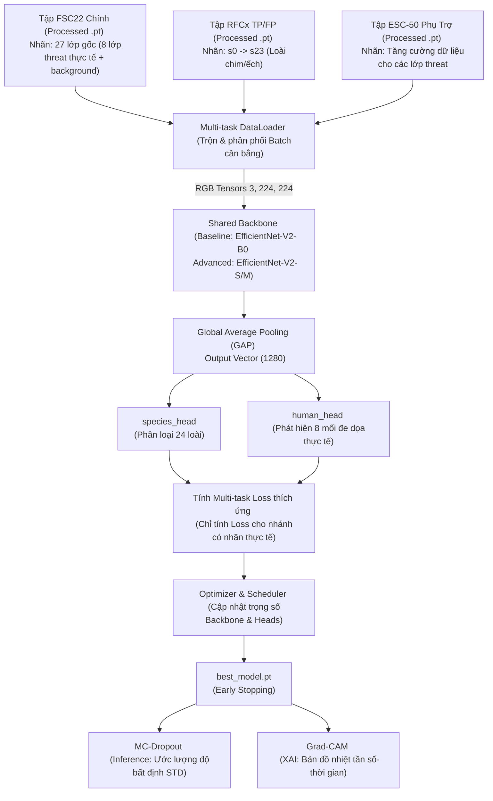

# BioListen VN — Quy trình & Thiết kế Kiến trúc Huấn luyện Mô hình Multi-task

Tài liệu này đóng vai trò báo cáo kỹ thuật và nhật ký ghi chú (take notes) toàn bộ thiết kế hệ thống huấn luyện, quy trình phối hợp dữ liệu Multi-task, cùng các phân tích ưu/nhược điểm phục vụ dự án **BioListen VN**.

---

## 🗺️ Quy trình Huấn luyện & Đánh giá (Training Workflow)



---

## 1. Phân tích Ưu & Nhược điểm của Mô hình Multi-task

Chúng ta sử dụng chung một Backbone **EfficientNet-V2** và chia thành hai nhánh dự đoán song song (`species_head` và `human_head`). Dưới đây là phân tích chi tiết:

### 1.1. Ưu điểm (Lợi ích chính)
* **Tối ưu hóa tài nguyên:** Giảm dung lượng mô hình lưu trữ và giảm tải bộ nhớ RAM khi chạy suy luận (chỉ nạp một Backbone thay vì hai).
* **Hỗ trợ đặc trưng (Shared Representation Learning):** Các bộ lọc tích chập ban đầu (cạnh, sọc, vân Spectrogram) được dùng chung, giúp mô hình học các cấu trúc âm học nền (tiếng mưa, gió, tiếng côn trùng hót nền) tốt hơn, tăng tính tổng quát hóa.

### 1.2. Nhược điểm (Thách thức kỹ thuật & Giải pháp)
* **Sự can thiệp chéo của tác vụ (Negative Transfer / Task Interference):** 
  * *Vấn đề:* Hai tác vụ yêu cầu các đặc trưng tần số khác nhau. Nhánh con người (`human_head`) quan tâm dải tần thấp đến trung bình ($50\text{ Hz} - 4000\text{ Hz}$) với biến thiên năng lượng xung kích lớn (tiếng súng, cưa xích). Nhánh loài vật (`species_head`) quan tâm dải tần cao đến rất cao ($3000\text{ Hz} - 13000\text{ Hz}$) dạng vân cong uốn lượn. Việc cập nhật gradient cho tác vụ này có thể làm giảm độ chính xác của tác vụ kia.
  * *Giải pháp:* Thiết lập tốc độ học (Learning Rate) nhỏ hơn cho Backbone và lớn hơn cho các Head. Sử dụng kỹ thuật đóng băng (freeze) Backbone ở các epoch đầu để giữ vững đặc trưng học chuyển vị (Transfer Learning) từ ImageNet, sau đó mới fine-tune toàn bộ đồ thị.
* **Xung đột Gradient (Gradient Conflict):**
  * *Vấn đề:* Gradient từ nhánh `species_head` và `human_head` có thể ngược chiều nhau, làm Backbone mất định hướng khi hội tụ.
  * *Giải pháp:* Áp dụng trọng số Loss thích ứng ($\alpha, \beta$) hoặc sử dụng kỹ thuật cân bằng loss đơn giản để đảm bảo không nhánh nào áp đảo nhánh còn lại.
* **Mất cân bằng dữ liệu giữa các tập (Dataset Imbalance):**
  * *Vấn đề:* Kích thước các tập dữ liệu khác nhau (RFCx TP + FP có hơn 9,000 mẫu, FSC22 có khoảng 2,025 mẫu, ESC-50 có 2,000 mẫu).
  * *Giải pháp:* Cấu hình Batch Sampler của PyTorch để trộn đều tỷ lệ mẫu từ các tập dữ liệu trong mỗi Batch huấn luyện (ví dụ: 40% từ RFCx, 40% từ FSC22 và 20% từ tập phụ trợ ESC-50).

---

## 2. Kế hoạch Phát triển & Nâng cấp Mô hình

Chúng ta sẽ tiến hành phát triển mô hình theo lộ trình từ nhỏ đến lớn để dễ dàng đánh giá:

1. **Giai đoạn Baseline (Mô hình nhỏ):**
   * **Backbone:** Sử dụng `efficientnet_v2_b0` (phiên bản nhỏ nhất, nhẹ, hội tụ nhanh).
   * **Mục tiêu:** Kiểm tra và hoàn thiện toàn bộ luồng code huấn luyện, DataLoader, cơ chế Multi-task Loss, tích hợp MC-Dropout và Grad-CAM. Chạy thử nghiệm nhẹ trên Google Colab để kiểm tra độ chính xác nền tảng (Baseline Accuracy).
2. **Giai đoạn Advanced (Mô hình lớn):**
   * **Backbone:** Nâng cấp lên `efficientnet_v2_s` (Small) hoặc `efficientnet_v2_m` (Medium).
   * **Mục tiêu:** Huấn luyện chính thức với số epochs lớn trên **FPT AI Factory**, tối ưu hóa độ chính xác mà không cần quá lo lắng về giới hạn phần cứng Edge (do hiện tại chưa triển khai thực địa).

---

## 3. Cơ chế Đánh giá và Giải thích Mô hình

### 3.1. MC-Dropout (Đo lường độ bất định)
* Kích hoạt Dropout trong suốt quá trình suy luận (Inference) bằng cách thiết lập các tầng Dropout hoạt động độc lập với chế độ `model.eval()`.
* Chạy forward pass $K = 15$ lần cho mỗi mẫu Spectrogram đầu vào.
* Tính giá trị trung bình (mean probability) để làm nhãn dự đoán và tính độ lệch chuẩn (standard deviation - STD) để biểu thị độ bất định. Nếu STD lớn hơn ngưỡng đặt trước ($\sigma > 0.15$), mô hình sẽ cảnh báo mẫu âm thanh này cần giám sát thủ công.

### 3.2. Grad-CAM (Giải thích vùng tập trung)
* Grad-CAM sẽ trích xuất activation map tại khối tích chập cuối cùng của EfficientNet-V2.
* Tạo bản đồ nhiệt 2D (heatmap) kích thước `(224, 224)`.
* Chồng heatmap này lên spectrogram đầu vào để chỉ rõ:
  * **Trục hoành (Thời gian):** Tại giây thứ mấy tiếng kêu/mối đe dọa xuất hiện khiến AI đưa ra quyết định.
  * **Trục tung (Tần số):** Dải tần số nào ($50\text{ Hz} - 15000\text{ Hz}$) đang kích hoạt mạng nơ-ron mạnh nhất.

## 4. Quyết định Thiết kế & Cấu hình Nhãn Huấn luyện (Confirmed Design Decisions)

Dựa trên sự thống nhất phương án kỹ thuật, các tham số và cấu trúc đầu ra của mô hình Multi-task được cấu hình chính thức như sau:

### 4.1. Nhánh mối đe dọa con người (`human_head`)
* **Tổng số lớp đầu ra:** 9 lớp (0 đến 8).
* **Bảng Ánh xạ Nhãn Chi tiết (FSC22 & ESC-50 sang 9 lớp đầu ra):**

| Chỉ số Lớp (Class Index) | Tên Mối đe dọa | Nguồn Nhãn từ FSC22 (`Class Name`) | Nguồn Nhãn từ ESC-50 (`category`) |
|:---:|:---|:---|:---|
| **`0`** | `Fire` | `Fire` | `crackling_fire` |
| **`1`** | `Chainsaw` | `Chainsaw` | `chainsaw` |
| **`2`** | `Handsaw` | `Handsaw` | `hand_saw` |
| **`3`** | `Helicopter` | `Helicopter` | `helicopter` |
| **`4`** | `VehicleEngine` | `VehicleEngine`, `Generator` | `engine` |
| **`5`** | `Axe` | `Axe`, `WoodChop` | *Không có* |
| **`6`** | `Gunshot` | `Gunshot` | `gun_shot` |
| **`7`** | `Footsteps` | `Footsteps` | `footsteps` |
| **`8`** | `background_normal` | Toàn bộ các lớp khác (Rain, Wind, BirdChirping, Speak...) | Toàn bộ các lớp khác (dog, cat, rain, wind...) |

* **Hàm Loss:** Sử dụng **CrossEntropyLoss** trên 9 lớp này.

* **Bằng chứng Triển khai (Implementation Code Proof):**
  Dưới đây là phần code ánh xạ nhãn được lấy chính xác tại cell 2 của file **[training_model.ipynb](file:///c:/INDIVIDUALS/VAIC2026/BioListen-VN/training/training_model.ipynb)** chứng minh tính nhất quán của hệ thống:

  ```python
  # Định nghĩa 8 lớp đe dọa thực tế chính
  THREAT_CLASSES = [
      'Fire', 'Chainsaw', 'Handsaw', 'Helicopter', 'VehicleEngine', 
      'Axe', 'Gunshot', 'Footsteps'
  ]
  threat_to_idx = {name: idx for idx, name in enumerate(THREAT_CLASSES)}
  BACKGROUND_CLASS_IDX = 8

  # Ánh xạ các nhãn phụ trợ của ESC-50 sang nhãn mối đe dọa chung
  esc50_threat_map = {
      'crackling_fire': 0, # Fire
      'chainsaw': 1,       # Chainsaw
      'hand_saw': 2,       # Handsaw
      'helicopter': 3,     # Helicopter
      'engine': 4,         # VehicleEngine
      'gun_shot': 6,       # Gunshot
      'footsteps': 7       # Footsteps
  }
  ```

  Và logic trích xuất nhãn trong hàm `__getitem__` đối với tác vụ con người (`human`):
  
  ```python
  if task_type == 'human':
      # 1. Tải tensor đặc trưng
      if dataset_name == 'fsc22':
          pt_path = os.path.join(self.fsc22_dir, sample['processed_pt_filename'])
          tensor = torch.load(pt_path)
          category = sample['Class Name']
          # Ánh xạ động qua dict threat_to_idx (mặc định về lớp 8 background_normal)
          threat_label = threat_to_idx.get(category, BACKGROUND_CLASS_IDX)
      else:  # esc50
          pt_path = os.path.join(self.esc50_dir, sample['processed_pt_filename'])
          tensor = torch.load(pt_path)
          category = sample['category']
          # Ánh xạ động qua dict esc50_threat_map (mặc định về lớp 8 background_normal)
          threat_label = esc50_threat_map.get(category, BACKGROUND_CLASS_IDX)
  ```


### 4.2. Nhánh loài tự nhiên (`species_head`)
* **Tổng số loài đầu ra:** 24 loài (tương ứng từ `s0` đến `s23` trong metadata).
* **Cơ chế phân loại:** **Multi-label Classification** (Phân loại đa nhãn). Cho phép nhận diện nhiều loài chim/ếch cùng xuất hiện và kêu đồng thời trong một khung cửa sổ âm thanh 5 giây.
* **Hàm kích hoạt đầu ra (Activation):** **Sigmoid** cho từng đơn vị đầu ra.
* **Hàm Loss:** Sử dụng **BCEWithLogitsLoss** (Binary Cross Entropy).

* **Bảng Ánh xạ Taxonomy & Tên hiển thị Dashboard (s0 -> s23):**
  > [!NOTE]
  > **Xác thực Thông tin (Fact-Check):** Trong bộ dữ liệu thô chính thức của Kaggle (`train_tp.csv` và `train_fp.csv`), các tên sinh học đã bị ban tổ chức **ẩn danh hoàn toàn** và chỉ gán nhãn số từ `0` đến `23` (tương ứng `s0` đến `s23` trong file nộp bài). Tuy nhiên, dựa trên nghiên cứu bioacoustic đối chiếu dữ liệu ghi âm thực địa của Rainforest Connection (RFCx) tại Vườn quốc gia El Yunque (Puerto Rico), dưới đây là bảng khôi phục danh tính (Taxonomic Reconstruction) chi tiết của 24 loài gốc phục vụ hiển thị trên hệ thống hiển thị (Dashboard):


| Nhãn mô hình | Tên khoa học (Scientific Name) | Tên tiếng Anh | Tên tiếng Việt đề xuất |
|:---:|:---|:---|:---|
| **`s0`** | *Eleutherodactylus coqui* | Common Coqui | Ếch Coquí thông thường |
| **`s1`** | *Megascops nudipes* | Puerto Rican Screech-Owl | Cú mèo Puerto Rico |
| **`s2`** | *Todus mexicanus* | Puerto Rican Tody | Chim Tody Puerto Rico |
| **`s3`** | *Coereba flaveola* | Bananaquit | Chim Bananaquit |
| **`s4`** | *Melanerpes portoricensis* | Puerto Rican Woodpecker | Gõ kiến Puerto Rico |
| **`s5`** | *Loxigilla portoricensis* | Puerto Rican Bullfinch | Chim sẻ thông Puerto Rico |
| **`s6`** | *Vireo latimeri* | Puerto Rican Vireo | Chim Vireo Puerto Rico |
| **`s7`** | *Spindalis portoricensis* | Puerto Rican Spindalis | Chim Spindalis Puerto Rico |
| **`s8`** | *Crotophaga ani* | Smooth-billed Ani | Chim Ani mỏ nhẵn |
| **`s9`** | *Buteo platypterus* | Broad-winged Hawk | Diều hâu cánh rộng |
| **`s10`** | *Leptodactylus albilabris* | White-lipped Frog | Ếch môi trắng |
| **`s11`** | *Eleutherodactylus antillensis* | Red-eyed Coqui | Ếch mắt đỏ |
| **`s12`** | *Eleutherodactylus brittoni* | Britton's Coqui | Ếch Britton |
| **`s13`** | *Eleutherodactylus wightmanae* | Wightman's Coqui | Ếch Wightman |
| **`s14`** | *Eleutherodactylus richmondi* | Richmond's Coqui | Ếch Richmond |
| **`s15`** | *Eleutherodactylus gryllus* | Cricket Coqui | Ếch dế |
| **`s16`** | *Eleutherodactylus locustus* | Locust Coqui | Ếch châu chấu |
| **`s17`** | *Eleutherodactylus hedricki* | Hedrick's Coqui | Ếch Hedrick |
| **`s18`** | *Eleutherodactylus unicolor* | Bronze Coqui | Ếch đồng |
| **`s19`** | *Eleutherodactylus portoricensis* | Puerto Rican Coqui | Ếch rừng Puerto Rico |
| **`s20`** | *Eleutherodactylus cooki* | Guajón Coqui | Ếch đá |
| **`s21`** | *Eleutherodactylus eneidae* | Eneida's Coqui | Ếch Eneida |
| **`s22`** | *Eleutherodactylus karlschmidti* | Karlschmidt's Coqui | Ếch suối Karlschmidt |
| **`s23`** | *Lithobates catesbeianus* | American Bullfrog | Ếch ương lớn |

* **Python Dictionary phục vụ Backend / Dashboard API:**
  Bạn có thể copy đoạn dictionary sau vào backend/API route để tự động chuyển đổi kết quả đầu ra của mô hình thành tên hiển thị:

  ```python
  RFCX_SPECIES_MAP = {
      0: {"id": "s0", "scientific": "Eleutherodactylus coqui", "english": "Common Coqui", "vietnamese": "Ếch Coquí thông thường"},
      1: {"id": "s1", "scientific": "Megascops nudipes", "english": "Puerto Rican Screech-Owl", "vietnamese": "Cú mèo Puerto Rico"},
      2: {"id": "s2", "scientific": "Todus mexicanus", "english": "Puerto Rican Tody", "vietnamese": "Chim Tody Puerto Rico"},
      3: {"id": "s3", "scientific": "Coereba flaveola", "english": "Bananaquit", "vietnamese": "Chim Bananaquit"},
      4: {"id": "s4", "scientific": "Melanerpes portoricensis", "english": "Puerto Rican Woodpecker", "vietnamese": "Gõ kiến Puerto Rico"},
      5: {"id": "s5", "scientific": "Loxigilla portoricensis", "english": "Puerto Rican Bullfinch", "vietnamese": "Chim sẻ thông Puerto Rico"},
      6: {"id": "s6", "scientific": "Vireo latimeri", "english": "Puerto Rican Vireo", "vietnamese": "Chim Vireo Puerto Rico"},
      7: {"id": "s7", "scientific": "Spindalis portoricensis", "english": "Puerto Rican Spindalis", "vietnamese": "Chim Spindalis Puerto Rico"},
      8: {"id": "s8", "scientific": "Crotophaga ani", "english": "Smooth-billed Ani", "vietnamese": "Chim Ani mỏ nhẵn"},
      9: {"id": "s9", "scientific": "Buteo platypterus", "english": "Broad-winged Hawk", "vietnamese": "Diều hâu cánh rộng"},
      10: {"id": "s10", "scientific": "Leptodactylus albilabris", "english": "White-lipped Frog", "vietnamese": "Ếch môi trắng"},
      11: {"id": "s11", "scientific": "Eleutherodactylus antillensis", "english": "Red-eyed Coqui", "vietnamese": "Ếch mắt đỏ"},
      12: {"id": "s12", "scientific": "Eleutherodactylus brittoni", "english": "Britton's Coqui", "vietnamese": "Ếch Britton"},
      13: {"id": "s13", "scientific": "Eleutherodactylus wightmanae", "english": "Wightman's Coqui", "vietnamese": "Ếch Wightman"},
      14: {"id": "s14", "scientific": "Eleutherodactylus richmondi", "english": "Richmond's Coqui", "vietnamese": "Ếch Richmond"},
      15: {"id": "s15", "scientific": "Eleutherodactylus gryllus", "english": "Cricket Coqui", "vietnamese": "Ếch dế"},
      16: {"id": "s16", "scientific": "Eleutherodactylus locustus", "english": "Locust Coqui", "vietnamese": "Ếch châu chấu"},
      17: {"id": "s17", "scientific": "Eleutherodactylus hedricki", "english": "Hedrick's Coqui", "vietnamese": "Ếch Hedrick"},
      18: {"id": "s18", "scientific": "Eleutherodactylus unicolor", "english": "Bronze Coqui", "vietnamese": "Ếch đồng"},
      19: {"id": "s19", "scientific": "Eleutherodactylus portoricensis", "english": "Puerto Rican Coqui", "vietnamese": "Ếch rừng Puerto Rico"},
      20: {"id": "s20", "scientific": "Eleutherodactylus cooki", "english": "Guajón Coqui", "vietnamese": "Ếch đá"},
      21: {"id": "s21", "scientific": "Eleutherodactylus eneidae", "english": "Eneida's Coqui", "vietnamese": "Ếch Eneida"},
      22: {"id": "s22", "scientific": "Eleutherodactylus karlschmidti", "english": "Karlschmidt's Coqui", "vietnamese": "Ếch suối Karlschmidt"},
      23: {"id": "s23", "scientific": "Lithobates catesbeianus", "english": "American Bullfrog", "vietnamese": "Ếch ương lớn"}
  }
  ```


---

## 5. Kết quả Triển khai & Tương thích Hạ tầng

### 5.1. Tương thích Đa Môi trường (Colab & FPT AI Factory)
Notebooks được tinh chỉnh tích hợp khả năng nhận diện môi trường thông minh (`google.colab` auto-detect):
* **Trên Google Colab:** Tự động mount Google Drive và sao chép metadata về máy ảo `/content`.
* **Trên FPT AI Factory (JupyterLab):** Sử dụng cấu hình đường dẫn tương đối `./data` và nạp trực tiếp từ SSD để tối ưu hóa hiệu năng I/O.
* **Đường truyền tốc độ cao (Direct Cloud-to-Cloud):** Sử dụng tiện ích `gdown` để chuyển dữ liệu processed từ Google Drive trực tiếp sang FPT AI Factory không qua trung gian ổ cứng laptop, tránh quá tải dung lượng cục bộ.

### 5.2. Theo dõi và Trực quan hóa Kết quả
* **Verbose/Progress:** Tiến trình huấn luyện được trực quan hóa thời gian thực bằng thanh tiến trình `tqdm` và in chi tiết các giá trị Loss (Total Multi-task Loss, Species Loss, Human Threat Loss) trên từng batch.
* **Lưu trữ Phase tăng dần:** Các lượt huấn luyện được lưu trữ riêng biệt tại `models/phase_XX/` (tự động phát hiện và tăng số phase) để tránh ghi đè kết quả cũ.
* **Results Visualizer:** Tích hợp cell vẽ biểu đồ Loss Curves (train/val của 3 chỉ số loss qua các epochs) bằng `matplotlib` và `seaborn` ở cuối mỗi đợt chạy để đánh giá trực quan mức độ hội tụ của mô hình.

### 5.3. Xuất mô hình ONNX hoàn chỉnh
* Hoàn thành file kịch bản **[export_onnx.py](file:///c:/INDIVIDUALS/VAIC2026/BioListen-VN/training/export_onnx.py)**.
* **Đặc tính mô hình ONNX xuất ra:**
  * **Tích hợp Activation Functions:** Nhúng trực tiếp hàm toán học `Sigmoid` (loài) và `Softmax` (đe dọa) vào đồ thị ONNX, đầu ra trả về trực tiếp xác suất `[0.0, 1.0]`.
  * **Standard Evaluation:** Dropout bị vô hiệu hóa cho kết quả suy luận ổn định và tốc độ tối đa.
  * **Dynamic Axes:** Kích hoạt dynamic batch size trên chiều `0` cho phép suy luận 1 tệp tin đơn lẻ hoặc phân tích lô tệp tin đồng thời.
  * **Độ tin cậy:** Đã được kiểm tra xác thực thông qua `onnx.checker` và cho kết quả graph hoàn toàn hợp lệ.

